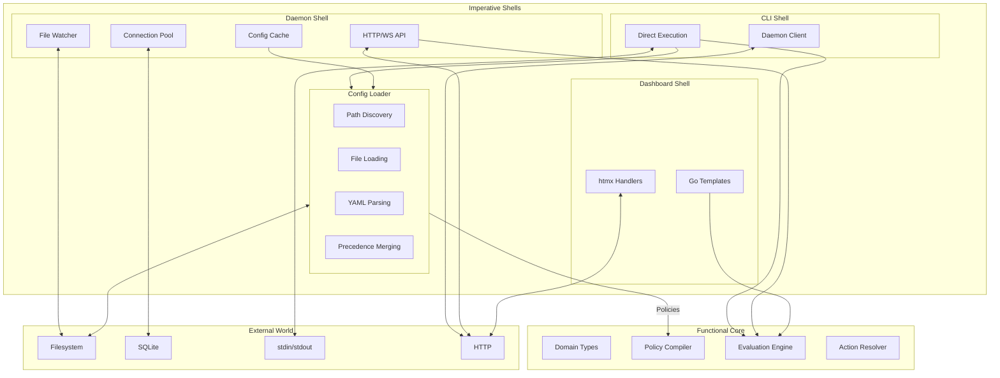
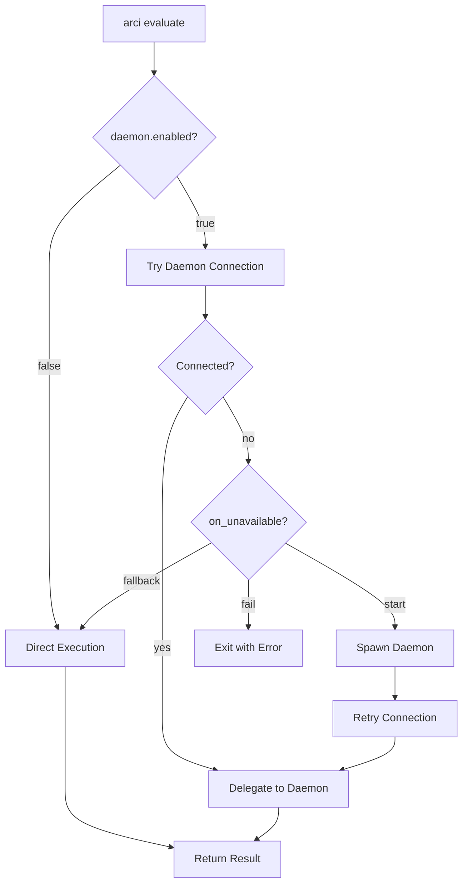
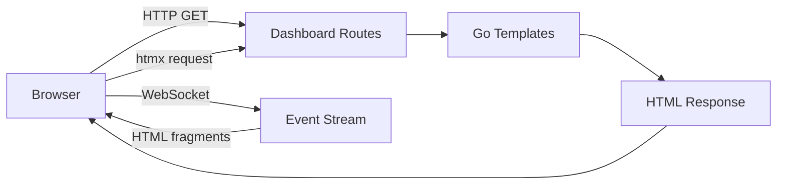

# Architecture

arci follows a functional core/imperative shell architecture. The core evaluation engine is a pure library with no I/O or side effects—it takes data in and returns data out. Multiple imperative shells handle the messy real-world concerns: the CLI loads configuration and executes directly, the daemon caches configuration and serves an API, and the dashboard provides a diagnostic interface.

This document describes the major components and how they interact.

## Design philosophy

The functional core/imperative shell pattern separates pure computation from side effects. The core contains all the interesting logic—policy matching, expression evaluation, action resolution—but performs no I/O. It receives configuration and input as arguments, returns results as data structures. This makes the core easy to test, reason about, and reuse.

The shells handle everything else: reading files, managing processes, opening sockets, writing output. Each shell is a thin adapter that translates between the outside world and the core's pure interface. Because the shells are thin, they're easy to write and maintain. Because the core is pure, it's easy to test and debug.

arci has three shells that all use the same core:

The CLI direct execution shell loads configuration from disk, calls the core, and writes output. This is the simplest path and requires no external processes.

The daemon shell keeps configuration cached in memory, exposes the core via HTTP API, and handles concerns like hot-reloading and metrics. The CLI can delegate to the daemon for better performance.

The dashboard shell provides a web interface for diagnostics, policy testing, and state inspection. It reads from the daemon's cached state and renders HTML.

## Functional core

The core is a pure library that performs policy evaluation. It has no dependencies on I/O, no global state, and no side effects. All inputs are explicit function arguments; all outputs are return values.

### Domain types

The core defines the domain types that matter for policy evaluation: `Policy`, `Rule`, `Match`, `Condition`, `Parameter`, `Variable`, `Macro`, and related structures. These are the atoms of the policy system—plain data structures with no knowledge of where they came from or how they were serialized.

The core has no knowledge of YAML, file paths, precedence layers, or configuration merging. It receives domain objects and operates on them. Where those objects came from is not its concern.

A `Policy` is a self-contained unit that declares its own matching, parameters, and enforcement. It contains structural match constraints declaring what event types, tools, paths, and branches it handles; conditions as CEL expressions that must all return true for the policy to apply; parameter definitions for bringing external data into evaluation; variable definitions for computed values; macros for reusable expression fragments; and rules that contain the actual validations, mutations, and effects.

Match constraints use OR-within-arrays, AND-across-fields logic for structural matching. Parameters can come from static values, named providers, inline providers, or environment variables. Variables are computed in declaration order and can reference parameters and earlier variables. Macros are invoked with a `$` prefix in CEL expressions.

A `Rule` is the unit within a policy that performs validation, mutation, or side effects. Each rule has its own optional match constraints (which intersect with the policy's match), conditions, and variables. A rule must contain at least one of `validate`, `mutate`, or `effects`. The `validate` block checks a CEL expression and produces an action (deny, warn, audit) on failure. The `mutate` block transforms the hook event using CEL's immutable update syntax. The `effects` list contains fire-and-forget actions like state updates, notifications, and logging.

This self-contained design prioritizes clarity: a policy file should be readable top to bottom and understandable without cross-referencing other documents. Reuse is handled through variables and macros for expression reuse, parameter providers for external data, and the config cascade for layered overrides.

### Policy compilation

The policy compiler takes policies and returns compiled structures with pre-parsed CEL expressions. Compilation validates CEL syntax in conditions (both policy-level and rule-level), validate expressions, and mutate expressions. It also validates macro definitions, checks variable reference ordering, and prepares policies for efficient evaluation through the six-stage pipeline. Compilation is deterministic and cacheable—the same input always produces the same output.

The shell materializes `Policy` objects from configuration files. The core's `CompilePolicies` function takes these as input and returns compiled structures with pre-parsed expressions and indexed match constraints for fast structural filtering.

Compilation is also where semantic validation happens. If an expression has invalid syntax, references unknown functions, contains circular variable dependencies, or a rule's match tries to widen rather than narrow the policy's constraints, compilation fails with a clear error. This keeps validation close to usage—the core validates what it needs to operate correctly.

### Evaluation engine

The evaluation engine is the heart of arci. It takes a hook event, compiled policies, and current state; returns matched policies, mutations to apply, validation results, effects to execute, and resolved actions. No I/O happens here—state is passed in and results are returned as data.

The evaluation pipeline has six stages:

**Stage 1: structural matching.** The engine filters policies using indexable criteria that can be evaluated without CEL. For each policy, it checks whether the event satisfies the policy's `match` block (events, tools, paths, branches) using OR-within-arrays, AND-across-fields logic. For policies that pass, it further filters rules by checking each rule's optional `match` block against the event. This stage is fast—the engine can scan hundreds of policies in microseconds using precomputed indexes.

**Stage 2: condition evaluation.** For policies that pass structural matching, the engine evaluates policy-level conditions in declaration order. Conditions are CEL expressions that must all return true (AND logic with short-circuit evaluation). If any condition returns false, the policy is skipped for this event. For rules that pass structural matching, rule-level conditions are similarly evaluated.

**Stage 3: parameter resolution.** Before evaluating rules, the engine resolves all parameters declared in the policy. Parameters can come from static values, named providers, inline providers, or environment variables. If resolution fails and no defaults are provided, behavior depends on `config.failurePolicy`: with `allow` (the default) the policy is skipped; with `deny` the policy errors and blocks the tool call.

**Stage 4: variable computation.** Policy-level variables are computed in declaration order. Variables can reference parameters, built-in functions, and earlier variables. They are evaluated once per policy and cached for use by all rules. Rule-level variables are computed when the rule evaluates and can shadow policy-level variables.

**Stage 5: rule evaluation.** For each matching rule in declaration order, the engine executes the rule's `validate` or `mutate` block. Validation rules produce a result (pass or fail with an action). Mutation rules produce a transformation that is applied to the event state. Mutations from higher-priority policies are applied before lower-priority policies evaluate, allowing high-priority policies to transform requests in ways that affect lower-priority policy evaluation.

**Stage 6: effect execution.** After all rules have been evaluated and the admission decision is determined, queued effects are executed. Effects are fire-and-forget actions like state updates, notifications, and logging. Each effect has a `when` condition (`always`, `on_pass`, `on_fail`) that controls whether it runs. Effect execution failures are logged but don't affect the tool call decision.

The `Evaluate` function takes a hook event, compiled policies, parameter context, and current state as arguments, and returns a result containing matched policies, mutations to apply, validation results, effects to execute, resolved actions, state mutations, and output data. No I/O happens in this function.

### Action resolution

The action resolver determines what happens based on validation results from all matching policies. Each validation rule specifies its own action on failure: `deny` blocks the tool call, `warn` allows it with a warning, `audit` logs silently.

When multiple policies match, their results combine using most-restrictive-wins logic: `deny > warn > audit > allow`. If any validation from any policy produces a `deny`, the overall result is deny. If no denies but some warns, the overall result is warn. Messages from all failures accumulate in the response.

The `ResolveActions` function takes validation results as input and returns data describing the aggregated action, originating policies and rules, and collected messages for both users and the Claude Code.

## Config loader

The config loader is a shared shell component used by both CLI direct execution and the daemon. It handles all the I/O and transformation needed to turn configuration files into domain objects the core can use.

The loader performs four distinct operations. Discovery determines which configuration paths to check, using platform-appropriate directories. Loading reads file contents from disk, handling missing files, permission errors, and encoding issues gracefully. Parsing deserializes YAML content into untyped structures and validates them against the configuration schema. Materialization transforms validated structures into typed domain objects—`Policy` instances with their embedded rules, parameters, variables, and macros—that the core can compile.

The loader also handles precedence merging. When the same policy name appears in multiple configuration sources, the loader resolves which definition wins based on the precedence chain. The core never sees these conflicts—it receives clean vectors of policies with no duplicates.

The config loader orchestrates all shell-layer work. Its `DiscoverSources` method finds all relevant config paths for a given project root. Its `Load` method reads files and resolves precedence, producing a configuration struct that contains both shell-layer settings (like log level and daemon configuration) and materialized domain objects (policies and parameter provider configurations). The policies are then passed to the core's `CompilePolicies` function.

This separation means the core stays dependency-free—no YAML parsing, no schema validation, no filesystem access. Testing the core requires only constructing `Policy` values directly. Supporting new configuration formats (TOML, JSON) requires only shell changes.

## CLI shell

The CLI shell (`arci`) is invoked by Claude Code's hook system. It can operate in two modes: direct execution or daemon delegation.

### Direct execution

In direct execution mode, the CLI is a complete imperative shell around the functional core:

1. Read hook input from stdin (I/O)
2. Discover and load configuration via the config loader (I/O)
3. Compile policies (core)
4. Resolve parameters from param providers (I/O)
5. Read current state from SQLite (I/O)
6. Evaluate the hook event against policies (core)
7. Apply mutations and run validations (core)
8. Persist state mutations to SQLite (I/O)
9. Write output to stdout (I/O)
10. Exit with appropriate code (I/O)

This mode requires no external processes. The tradeoff is that configuration loading and policy compilation happen on every invocation—typically 10-50ms of overhead.

### Daemon delegation

In daemon delegation mode, the CLI is a thin HTTP client:

1. Read hook input from stdin (I/O)
2. POST to daemon's `/evaluate` endpoint (I/O)
3. Write response to stdout (I/O)
4. Exit with code from response (I/O)

The daemon handles configuration caching and state management. Evaluation overhead drops to single-digit milliseconds. See the daemon documentation for details on when to use this mode.

### Mode selection

The CLI checks `daemon.enabled` in configuration. When enabled, it attempts to connect to the daemon. The `daemon.auto_start.on_unavailable` setting controls fallback behavior: spawn the daemon, fall back to direct execution, or fail with an error.

## Daemon shell

The daemon (started via `arci daemon start`) is an optional performance optimization. It wraps the functional core with caching, connection pooling, and a network API.

### Responsibilities

The daemon's job is to amortize expensive operations across many requests:

Configuration is loaded once per project and cached. The file watcher triggers cache invalidation when files change. Hot reload is atomic—requests in flight use the old config, new requests get the new config.

Policies are compiled once when configuration loads. The compiled representations—CEL expressions for conditions, validations, mutations, and variable computations—are reused for every evaluation. Match constraints are indexed for fast structural filtering in stage 1 of the pipeline.

Parameter providers are queried and results cached with configurable TTL. This avoids repeated HTTP calls for dynamic parameters from external sources.

SQLite connections are pooled rather than opened per-request. The connection pool handles concurrent access from evaluation requests and the dashboard.

Metrics accumulate in memory across requests. Policy match counts, validation results, mutation statistics, and timing histograms are available via the API and dashboard.

### API layer

The daemon exposes the core via HTTP endpoints. Each endpoint is a thin wrapper that translates HTTP to core function calls. The endpoint handler is mostly I/O orchestration. The actual policy evaluation logic lives in the core.

### Event streaming

The daemon provides a WebSocket endpoint at `/events` for live event streaming. When evaluations happen, the daemon publishes events to connected clients. The dashboard uses this for real-time updates.

Events are derived from core evaluation results—the core doesn't know about WebSockets or streaming, it just returns data that the shell can choose to broadcast.

## Dashboard shell

The dashboard is a web interface for diagnostics, testing, and state inspection. It's another imperative shell around the functional core, focused on human interaction rather than programmatic access.

### Responsibilities

The dashboard provides visibility into arci's operation:

Live event streaming shows hook invocations, policy matches, and action executions as they happen. This uses the daemon's WebSocket API.

Policy statistics display match counts, validation results, execution times, and error rates aggregated from the daemon's metrics.

Configuration status shows which projects have loaded configs, when they were last reloaded, and any validation errors.

State browser lets you inspect session and project state stored in SQLite.

Policy tester provides an interactive interface to test policies against sample inputs. This is particularly useful for debugging complex expressions.

### Architecture

The dashboard is server-rendered HTML with htmx for interactivity. Go templates generate HTML; htmx handles dynamic updates without a JavaScript build system.

The dashboard reads from the daemon's cached state rather than hitting the filesystem or SQLite directly. This ensures consistency—the dashboard shows the same view of configuration and state that evaluation uses.

### Policy tester

The policy tester deserves special mention because it demonstrates the core/shell separation nicely. When you submit a test input through the dashboard:

1. The dashboard route parses the form submission (shell)
2. It constructs a synthetic hook event (shell)
3. It resolves any parameter references (shell)
4. It calls `evaluate()` with the current config (core)
5. It renders the result as HTML (shell)

The core doesn't know it's being called from a web form vs. a real hook invocation. It just evaluates policies against the input it receives.

## Testing strategy

The core/shell separation enables a clean testing strategy.

Core tests are fast unit tests with no mocking. Pass in domain objects, assert on return values. These tests verify policy compilation, expression evaluation, action resolution, and the six-stage evaluation pipeline works correctly. Because the core has no I/O, tests can construct arbitrary scenarios by building `Policy` values directly.

Core tests construct policies as Go values, compile them, create synthetic hook events, and assert on evaluation results. For example, a test for blocking dangerous rm commands would create a policy with match constraints for `pre_tool_call` events on the `Bash` tool, add a rule with a validation expression checking for the `-rf` flag and `action: deny`, compile the policy, evaluate against a synthetic event containing `rm -rf /`, and assert that one policy matched with a deny action.

Shell tests are integration tests that exercise I/O paths. They verify the CLI correctly reads stdin and writes stdout, the daemon correctly handles HTTP requests, the dashboard correctly renders templates. These tests may use fixtures, temporary directories, or test servers.

Shell tests use `os/exec` to run the CLI binary with fixture configuration, pipe hook input through stdin, and assert on the JSON output and exit code.

End-to-end tests verify the full system works together: CLI talks to daemon, daemon evaluates correctly, state persists across requests. These are slower and run less frequently. Use `go test ./...` for unit and integration tests.

## Technology choices

The core uses only the Go standard library plus `cel-go` for condition expression evaluation, `text/template` with Sprig for template rendering, and the chosen scripting engine for embedded scripting. CEL provides type-safe boolean expressions for rule conditions, while Go's `text/template` with Sprig handles dynamic string output in action messages and content. Keeping dependencies minimal makes the core easy to understand and test.

The CLI shell uses `cobra` for command parsing and `net/http` for HTTP. Both are well-maintained, widely-used libraries in the Go ecosystem.

The daemon shell uses `net/http` with the `chi` router for the HTTP API and `nhooyr.io/websocket` for WebSocket support. Go's built-in concurrency model with goroutines and channels replaces the need for a separate async runtime.

The dashboard shell uses Go's `html/template` with Sprig for templates and htmx for interactivity. Server-side rendering keeps things simple—no JavaScript build system, no client-side state management. The dashboard uses `html/template` rather than `text/template` for automatic XSS protection.

File watching uses the `fsnotify` package, which provides cross-platform filesystem event notifications.

State storage uses SQLite via `database/sql` with `modernc.org/sqlite` (a pure-Go driver). SQLite is robust, requires no external process, and handles the concurrency patterns arci needs. The `database/sql` package provides built-in connection pooling.

Configuration parsing uses `gopkg.in/yaml.v3` for YAML deserialization. Struct tags make schema definition straightforward while providing clear error messages.
