# Daemon

The ARCI daemon is an optional performance optimization that keeps configuration pre-loaded, expressions pre-compiled, and state store connections pooled. For most users, ARCI works without a daemon; the CLI loads configuration and applies policies directly. The daemon becomes valuable when you have many policies, complex expressions, or need features like the diagnostics dashboard.

The daemon runs as part of the `arci` binary via the `arci daemon` command namespace, not as a separate binary.

## Operating modes

ARCI operates in two modes: direct execution and daemon-delegated execution. Both use the same evaluation engine; the difference is where configuration loading happens.

In direct execution mode, `arci hook apply` loads configuration, compiles policy expressions, and evaluates policies on every invocation. This is the default and requires no setup beyond installing ARCI and writing policies. The overhead is typically 50-200 ms depending on configuration complexity.

In daemon-delegated mode, `arci hook apply` sends requests to the running daemon, which maintains cached configuration and pre-compiled expressions. Evaluation overhead drops to single-digit milliseconds. The daemon also provides hot-reloading when configuration files change and serves the diagnostics dashboard.

Direct execution suits users who are getting started with ARCI, have a small number of policies (under ~50), don't need the diagnostics dashboard, or want the simplest possible setup. The daemon suits users with many policies or complex expressions who want sub-10 ms evaluation latency, need the diagnostics dashboard for debugging, or want hot-reload without restarting anything.

## Responsibilities

The daemon has five primary responsibilities.

Configuration management is the first. The daemon maintains a cache of merged configuration per project, watches configuration files for changes, and reloads automatically when they change. This eliminates the per-invocation cost of loading and parsing YAML files.

The daemon owns the core evaluation engine. It compiles policy expressions once and reuses them for each evaluation. This avoids the overhead of re-parsing expressions on every hook invocation.

State store connection management is another responsibility. The daemon pools SQLite connections for performance and handles concurrent access from evaluation requests and the dashboard.

Metrics accumulation happens in memory. The daemon tracks policy match counts, action executions, errors, and timing information. The API exposes these metrics, and the dashboard displays them.

Finally, the daemon serves the REST and WebSocket APIs that the CLI and dashboard use. It also serves the dashboard's static assets and rendered templates.

## Architecture

The daemon builds on Go's `net/http` with the `chi` router and `nhooyr.io/websocket`. Chi provides composable, lightweight HTTP routing. Go's goroutines and channels handle concurrent connections efficiently without a separate async runtime.

File watching uses the `fsnotify` package, which provides efficient cross-platform file system monitoring with support for Linux inotify, macOS FSEvents, and Windows ReadDirectoryChanges.

The dashboard uses Go's `html/template` with Sprig for server-side rendering and htmx for interactive updates without a JavaScript build system.

```mermaid
flowchart TB
    subgraph daemon["arci daemon"]
        subgraph http_server["HTTP Server"]
            subgraph routes["Routes"]
                apply_ep["POST /apply"]
                health_ep["GET /health"]
                config_status_ep["GET /config/status"]
                config_reload_ep["POST /config/reload"]
                policies_ep["GET /policies"]
                state_ep["GET /state"]
                metrics_ep["GET /metrics"]
                events_ep["WS /events"]
                dashboard_ep["GET /dashboard/*"]
            end
        end

        subgraph services["Services"]
            subgraph config_mgr["Config Manager"]
                cache["Cache\n(per-project)"]
                watcher["File Watcher\n(fsnotify)"]
                reload_svc["Reload"]
            end

            subgraph state_pool["State Store Pool"]
                sqlite[("SQLite")]
                sessions["Session scoping"]
            end

            subgraph metrics_acc["Metrics Accumulator"]
                policy_counts["Policy match counts"]
                action_stats["Action stats"]
                timing["Timing histograms"]
            end
        end

    end

    routes --> services
    watcher -.->|"hot reload"| cache
```

## API design

The daemon exposes an HTTP API for policy evaluation and management. All endpoints use JSON for request and response bodies.

### `POST /apply`

The primary endpoint for hook evaluation. The CLI calls this for every hook invocation when it runs in daemon mode.

The request body contains the current working directory and the hook input payload. The response body contains the JSON output to write to stdout (or null if no output) and the exit code the CLI should use.

This endpoint must be fast. It uses cached configuration, pre-compiled expressions, and pooled database connections. The handler deserializes the request, looks up the cached configuration for the project, runs the evaluation engine, and formats the output.

### `GET /health`

Health check endpoint for monitoring and orchestration. Returns HTTP 200 if the daemon is healthy, with a JSON body containing uptime and basic status.

### `GET /config/status`

Returns the status of configuration for all known projects. For each project, it reports whether configuration is valid, when it was last reloaded, and any validation errors.

### `POST /config/reload`

Forces a configuration reload. Accepts an optional `project` query parameter to reload a specific project, or reloads all if omitted.

### `GET /policies`

Returns the list of policies for a project. Accepts a `project` query parameter. Returns policy metadata including name, source file, priority, enabled status, event types, and rule count.

### `GET /state`

Returns state store entries. Accepts `project` and `session` query parameters for filtering. Returns entries with their values and metadata.

### `GET /metrics`

Returns a snapshot of accumulated metrics. Includes policy match counts, action execution counts, timing percentiles, and error counts.

### `WS /events`

WebSocket endpoint for live event streaming. Clients connect and receive real-time events including hook invocations, policy matches, action executions, errors, and configuration reloads. Events are JSON objects with a `type` field and event-specific data. The dashboard uses this for live updates.

### `GET /dashboard/*`

Serves the dashboard web interface. Returns HTML pages rendered with Go templates. Uses htmx for interactive updates.

## Configuration management

The daemon maintains a configuration cache keyed by project path. When a request comes in, the daemon looks up or creates the configuration for that project.

Configuration loading involves discovering sources, reading YAML files, parsing them, merging policies by precedence, compiling policy expressions, and caching the result. The daemon loads configuration for specific projects lazily on first request, keeping startup fast even with many potential projects.

The file watcher monitors all configuration source directories using the `fsnotify` package. When it detects a change, it marks the affected project's configuration dirty. On the next request for that project (or immediately if configured), the daemon reloads the configuration.

Reload is atomic from the perspective of evaluation. Requests in flight continue with the old configuration. New requests get the new configuration. There's no partial state. If configuration loading fails due to syntax errors or validation issues, the daemon logs the error and continues with the previous valid configuration. The configuration status endpoint reports the error.

## State store pool

The daemon manages SQLite connections for the state store. Each project has its own database file. The daemon pools connections for reuse. The project's database stores session-scoped state under the session ID. Project-scoped state uses an empty session ID.

The dashboard can read state without blocking evaluation requests. SQLite's reader/writer locking handles concurrency.

## Metrics accumulator

The daemon accumulates metrics in memory, including per-policy counters for matches and actions, histograms for evaluation timing, error counters by category, and request counters.

Metrics are reset on daemon restart. A future version could add persistent metrics, but in-memory is sufficient for diagnostics. The metrics endpoint returns a snapshot. The dashboard polls this periodically or uses the WebSocket for live updates.

## Lifecycle

The daemon runs in the foreground via `arci daemon start`. It logs to stderr, and the user can stop it with Ctrl+C. The daemon handles SIGTERM gracefully, completing in-flight requests before shutting down.

On startup, the daemon initializes the HTTP server and registers routes, starts the server on the configured port and optional Unix socket, initializes the file watcher for the config directory, and logs startup information via slog.

On shutdown (SIGTERM or SIGINT), the daemon stops accepting new connections, waits for in-flight requests to complete (with a timeout), stops the file watcher, closes state store connections, and exits.

## Delegation from CLI

When the configuration enables daemon mode, `arci hook apply` first attempts to connect to the daemon. If the daemon is reachable, the CLI delegates evaluation to it. If not, behavior depends on the `auto_start` setting: either start the daemon automatically, fall back to direct execution, or fail with an error.

The `on_unavailable` setting controls this behavior. The value `start` spawns the daemon automatically, then delegates evaluation. This provides the best latency after the first invocation but requires the daemon to be startable. The value `fallback` silently falls back to direct execution, providing graceful degradation: you get daemon performance when it's running, direct execution otherwise. This is the default. The value `fail` reports an error immediately, useful when managing the daemon externally and you want to know if it's down.

## Foreground-first philosophy

ARCI takes a "foreground-first" philosophy: the daemon itself never forks or backgrounds, and users choose how to manage its lifecycle. Traditional Unix daemonization involves a double-fork dance, closing file descriptors, and detaching from the controlling terminal. The complexity and platform-specific behavior make this unnecessary for a development tool.

Instead, ARCI runs in the foreground and delegates process lifecycle management to external tools that are purpose-built for it: system service managers, process supervisors, or the CLI's auto-start feature. This keeps the daemon's code focused on its core responsibilities and uses battle-tested process management tools.

## Daemonization approaches

Multiple approaches exist for keeping the daemon running. Users choose based on their environment and preferences.

Foreground with manual management is the simplest approach. Run `arci daemon start` in a terminal, tmux session, or screen. This works well for development and exploration.

System service managers are the recommended approach for persistent installations. On Linux, systemd provides reliable process supervision with automatic restart, resource limits, logging integration, and socket activation. On macOS, launchd offers similar capabilities. Both can start the daemon at login or on-demand.

Process supervisors like supervisord provide cross-platform process management without requiring root access. This is useful in environments where you can't install system services or want user-level management.

CLI auto-start provides a convenience mode where `arci hook apply` automatically starts the daemon if it's not running. When the CLI can't connect to the daemon, it spawns `arci daemon start` as a background process before retrying. The spawned daemon inherits environment variables but detaches from the terminal.

Container-based deployment runs the daemon in a Docker or Podman container. The container runtime handles lifecycle management.

Socket activation is a systemd-specific feature that starts the daemon on first connection. Systemd listens on the socket and spawns the daemon when traffic arrives. This reduces resource usage when the daemon is rarely needed. ARCI supports receiving pre-opened sockets from systemd.

## Platform considerations

Each platform has its idiomatic approach to service management.

On modern Linux distributions, systemd is standard. User services (via `systemctl --user`) don't require root and integrate well with desktop sessions. Socket activation is a compelling feature for on-demand startup.

On macOS, launchd is the native service manager. Launch agents run at user login and users manage them through `launchctl`. Launchd supports on-demand socket activation through its own mechanism.

On Windows, the daemon can run as a background process started by the CLI auto-start feature. Windows services require additional wrapper code and are probably overkill for a development tool. Users who need service-level management on Windows can use NSSM (Non-Sucking Service Manager) or similar tools.

For cross-platform consistency, the CLI auto-start feature works everywhere without platform-specific configuration.

## MCP integration

ARCI treats MCP as an optional diagnostic interface rather than a lifecycle mechanism. The main daemon runs via CLI auto-start, system services, or manual invocation. A separate lightweight MCP server can optionally connect to the running daemon and expose tools to Claude Code.

The MCP server process is stateless. It connects to the daemon's HTTP API and translates MCP tool calls into API requests.

The MCP server exposes diagnostic tools for querying status, listing active policies for the current project, and retrieving evaluation statistics. These tools provide introspection capabilities without requiring the daemon to be running. If the daemon is not running when the MCP server starts, it reports an error through MCP rather than attempting to spawn the daemon itself. This keeps lifecycle management cleanly separated.

## Error isolation

The daemon isolates errors to prevent cascading failures. Evaluation errors for one request don't affect other requests. Configuration errors for one project don't affect other projects. The daemon logs individual rule or action failures but doesn't fail the evaluation.

The API returns appropriate HTTP status codes: 200 for success, 400 for bad requests, 500 for internal errors. The `/apply` endpoint always returns 200 with an appropriate exit_code in the body, even for errors, maintaining fail-open semantics.

## Logging

The daemon uses structured logging with Go's `log/slog` package. Log entries include timestamps, log levels, and structured key-value attributes.

Log levels are configurable via the `ARCI_LOG_LEVEL` environment variable. Debug level logs detailed information about every evaluation. Info level logs key events like configuration reloads. Warning level logs recoverable errors. Error level logs failures that require attention.

Logs go to stderr by default. Production deployments might redirect to a file or logging service. The `slog` package supports multiple handlers for routing logs to different destinations.
