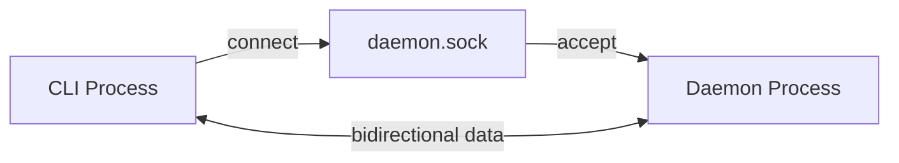
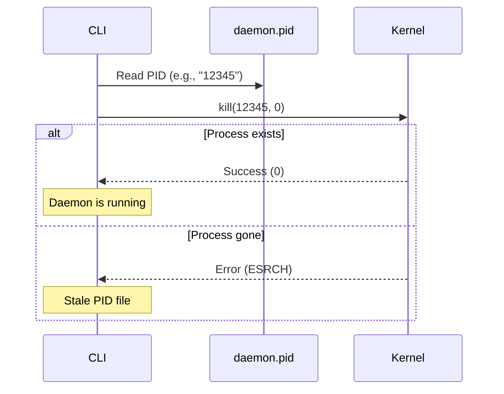
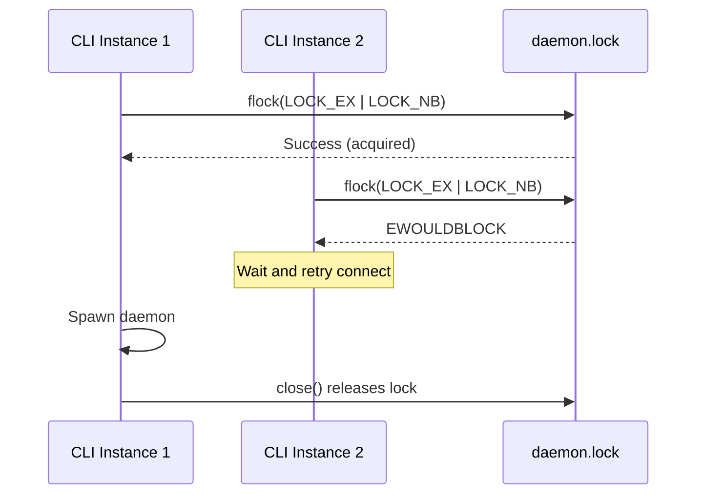
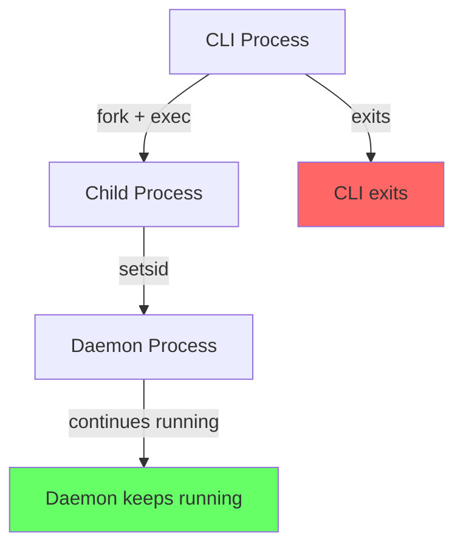
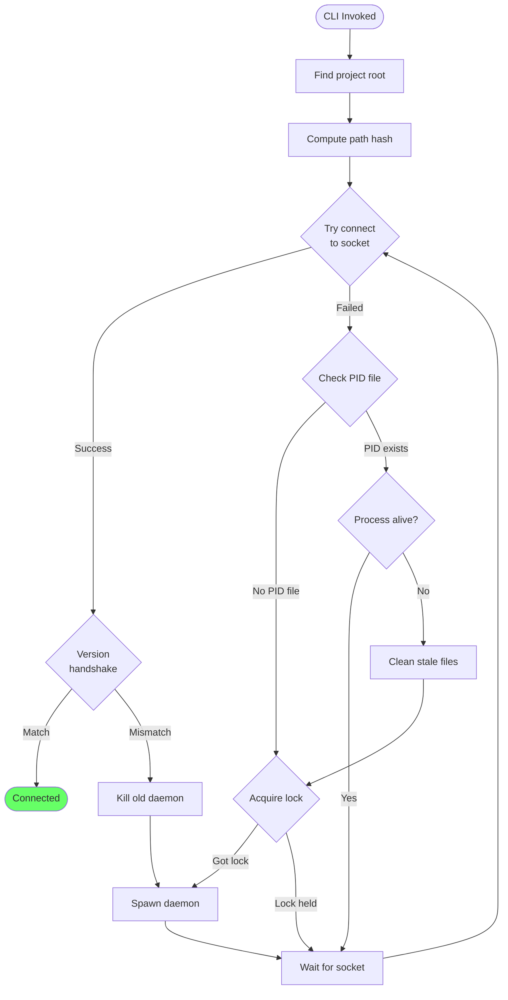
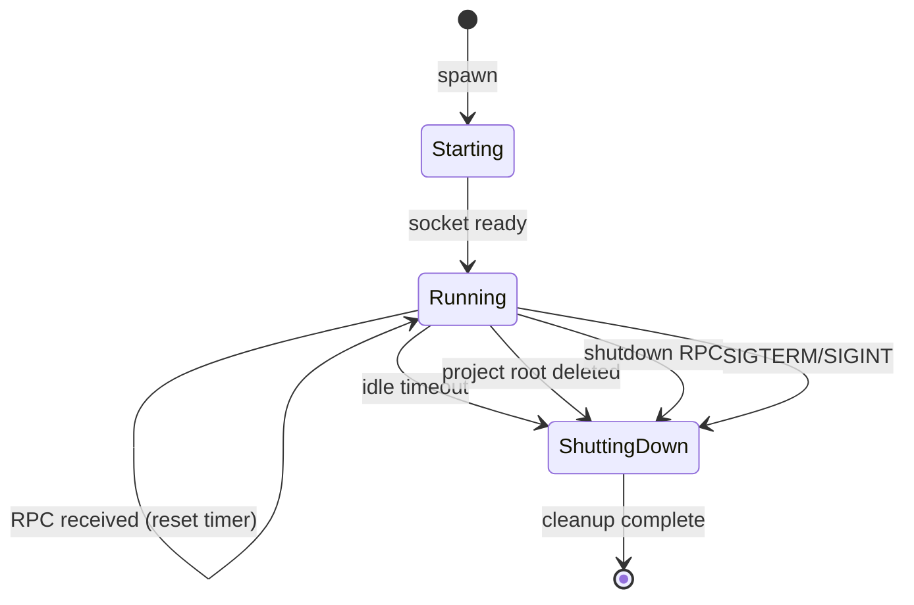
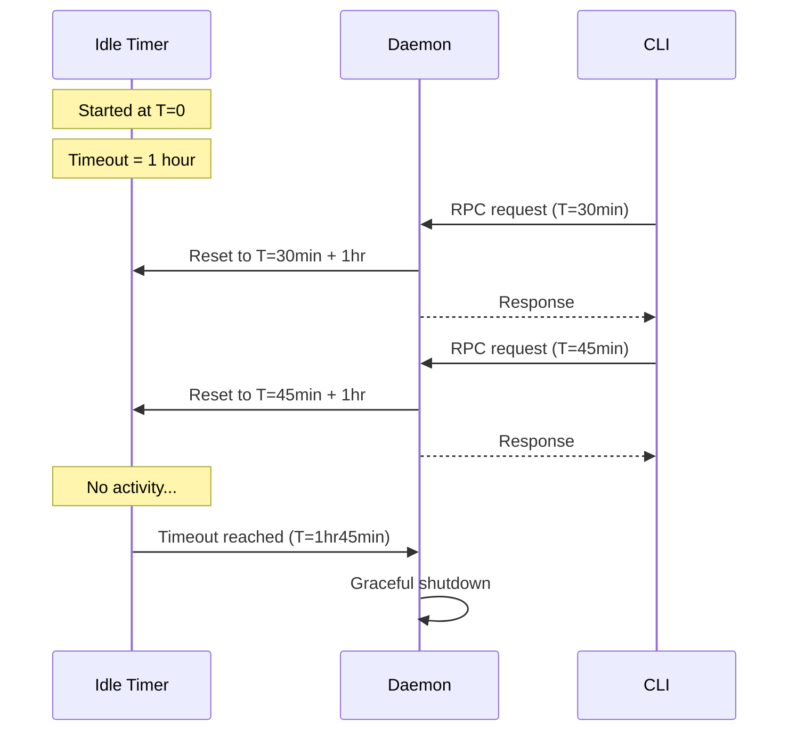
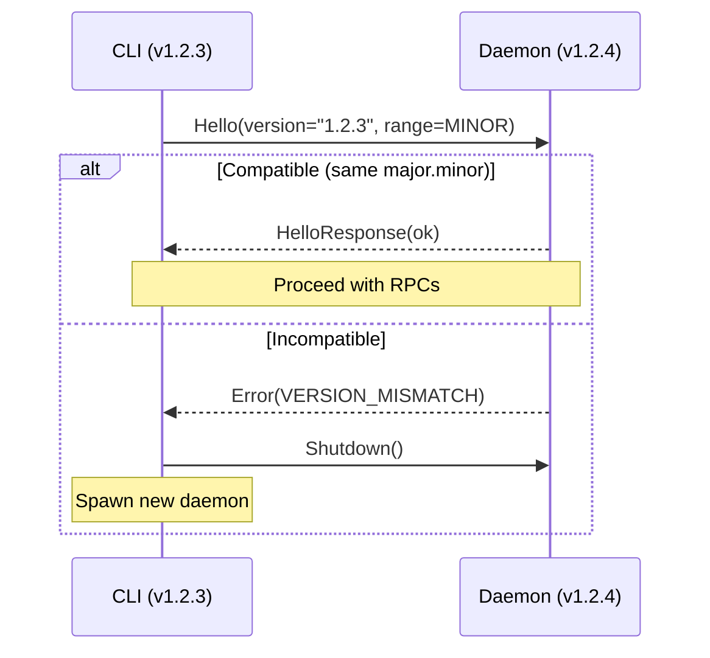
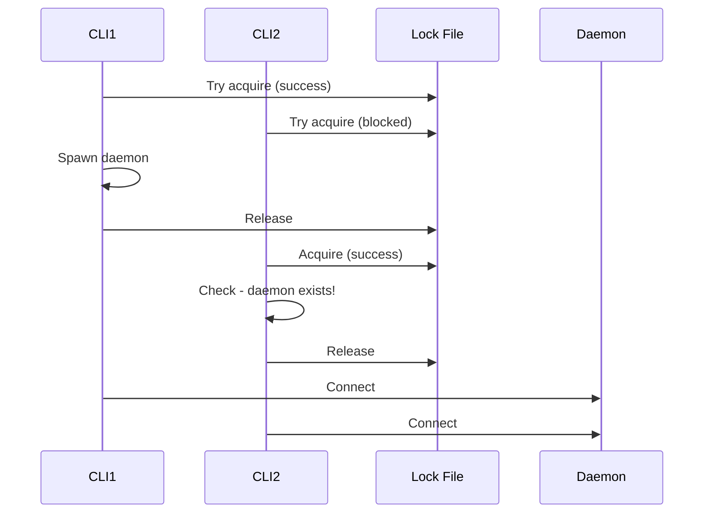

# Project-scoped daemon auto-spawn pattern

This document describes an architectural pattern for CLI tools that benefit from a persistent background process (daemon) to maintain state, caches, or perform expensive operations once rather than on every invocation. The pattern is "project-scoped," meaning each project directory gets its own isolated daemon instance.

## The problem

Many CLI tools perform expensive operations on every invocation: scanning directory trees, parsing configuration files, computing file hashes, maintaining caches, or watching for file changes. When a user runs the CLI repeatedly (common during development), this repeated work creates noticeable latency.

A daemon process can perform these operations once and keep results in memory, responding to CLI queries in milliseconds instead of seconds. However, daemons introduce complexity: the user must start, discover, connect to, version-match, and eventually clean them up.

The auto-spawn pattern solves this by making the daemon lifecycle invisible to the user. The CLI automatically starts a daemon if one isn't running, connects to an existing one if it is, and handles version mismatches and stale processes gracefully.

## Foundational concepts

### Unix domain sockets

A Unix domain socket (UDS) is an inter-process communication mechanism that uses the filesystem namespace. Unlike TCP sockets, UDS don't involve network stack overhead, as data passes directly through kernel buffers. They appear as special files on disk (`/tmp/myapp/daemon.sock`), which provides natural access control via filesystem permissions.



On Windows, the equivalent uses named pipes (`\\.\pipe\myapp`), though Windows 10+ also supports UDS with some limitations.

### Process identifiers and PID files

Every running process has a unique process identifier (PID) assigned by the kernel. A PID file is a simple text file containing the PID of a running daemon. It serves two purposes:

1. Discovery: other processes can read the file to find the daemon's PID
2. Liveness checking: given a PID, you can check if that process is still running



The `kill(pid, 0)` syscall with signal 0 is a standard trick: it performs all permission checks without actually sending a signal, effectively testing if the process exists.

### File locking

When multiple CLI invocations race to start a daemon, you need mutual exclusion. File locking provides this via two mechanisms:

**Advisory locking** (`flock`): a process requests a lock on a file descriptor. Other cooperating processes that also request locks block or fail. The lock is "advisory" because processes that don't request locks can still access the file.

**Atomic file creation**: opening a file with `O_CREAT | O_EXCL` flags atomically creates it only if it doesn't exist. If it exists, the call fails. This provides a simple mutex primitive.



### Process detachment (daemonization)

When spawning a daemon from a CLI, the daemon must outlive the CLI process. On Unix, this requires:

1. Creating a new session (`setsid`) so the daemon isn't tied to the CLI's terminal
2. Redirecting stdin/stdout/stderr away from the terminal
3. Not waiting for the child process (`cmd.Start()` without `cmd.Wait()`)



Go can't do a traditional `fork()` (the runtime doesn't survive it), so the standard approach is re-executing the same binary with a special flag or subcommand that puts it into daemon mode.

## Architecture overview

### File layout

Each project gets a unique identifier derived from its absolute path. This hash becomes the namespace for all daemon-related files:

```text
$TMPDIR/myapp/<project-hash>/
├── daemon.pid      # Contains daemon's PID
├── daemon.lock     # Lock file for startup race
└── daemon.sock     # Unix domain socket

$XDG_DATA_HOME/myapp/logs/
└── <project-hash>-<project-name>.log
```

```mermaid
graph TD
    subgraph "Project A: /home/user/projectA"
        A_Hash[hash: a1b2c3d4]
        A_Sock[/tmp/myapp/a1b2c3d4/daemon.sock]
        A_Pid[/tmp/myapp/a1b2c3d4/daemon.pid]
    end

    subgraph "Project B: /home/user/projectB"
        B_Hash[hash: e5f6g7h8]
        B_Sock[/tmp/myapp/e5f6g7h8/daemon.sock]
        B_Pid[/tmp/myapp/e5f6g7h8/daemon.pid]
    end

    CLI_A[CLI in Project A] --> A_Sock
    CLI_B[CLI in Project B] --> B_Sock
```

### Connection flow

The complete flow from CLI invocation to connected client:



### Daemon lifecycle

The daemon manages its own lifecycle with idle timeout and root watching:



### Idle timeout mechanism

The daemon should exit when not in use to avoid resource waste. An idle timeout with reset-on-activity achieves this:



## Protocol design

### Version negotiation

The daemon and CLI may be different versions (user updated CLI but old daemon still running). The handshake must detect this:



Semantic versioning ranges allow flexibility:

- **EXACT**: Versions must match exactly
- **PATCH**: `Major.Minor` must match, server patch >= client patch
- **MINOR**: Major must match, server minor >= client minor
- **MAJOR**: Major must match (most lenient)

### Core RPC interface

A minimal daemon needs these operations:

```protobuf
service Daemon {
  // Handshake with version check
  rpc Hello(HelloRequest) returns (HelloResponse);

  // Graceful shutdown
  rpc Shutdown(ShutdownRequest) returns (ShutdownResponse);

  // Health/status check
  rpc Status(StatusRequest) returns (StatusResponse);

  // Domain-specific operations...
  rpc DoExpensiveWork(WorkRequest) returns (WorkResponse);
}
```

## Error handling and edge cases

### Stale socket files

A daemon might crash without cleaning up its socket file. Subsequent connection attempts fail with "connection refused" rather than "no such file." The solution:

1. Check if PID file exists and process is alive
2. If process is dead, remove both PID and socket files
3. Proceed with normal startup

### Stale PID files

The PID in the file might refer to a long-dead process, or worse, a different process that reused the same PID. Solutions:

1. Verify process existence with `kill(pid, 0)`
2. Optionally verify it's actually your daemon (check command line in `/proc/<pid>/cmdline` on Linux)
3. If stale, clean up and proceed

### Race conditions

Multiple CLI instances racing to start a daemon:



The key insight: after acquiring the lock, always re-check if a daemon appeared while waiting.

### Project root deletion

If the user deletes or moves the project directory while the daemon is running, it should detect this and exit. A simple polling check or filesystem watch on the root directory handles this:

```go
go func() {
    ticker := time.NewTicker(30 * time.Second)
    for range ticker.C {
        if _, err := os.Stat(projectRoot); os.IsNotExist(err) {
            triggerShutdown()
            return
        }
    }
}()
```

## Cross-platform considerations

| Concern            | Unix                          | Windows                              |
| ------------------ | ----------------------------- | ------------------------------------ |
| IPC mechanism      | Unix domain socket            | Named pipe or UDS (Win10+)           |
| Socket path        | `/tmp/myapp/hash/daemon.sock` | `\\.\pipe\myapp-hash`                |
| Process detachment | `setsid()`                    | `CREATE_NEW_PROCESS_GROUP`           |
| Process existence  | `kill(pid, 0)`                | `OpenProcess` + `GetExitCodeProcess` |
| File locking       | `flock()`                     | `LockFileEx()`                       |

The pattern works on both platforms, but the specific details differ. Abstract these behind interfaces to keep the core logic platform-agnostic.

## Design decisions and trade-offs

### Why hash the project path?

1. **Length limits**: Unix socket paths have a limit of 104-108 bytes. Absolute paths can easily exceed this.
2. **Special characters**: Paths may contain characters invalid in filenames.
3. **Determinism**: Same path always produces same hash, so any CLI invocation finds the same daemon.

### Why use a lock file separate from the PID file?

The PID file serves as state (which process is the daemon). The lock file serves as a mutex (who's allowed to modify that state). Combining them creates subtle race conditions around reading vs. writing.

### Why idle timeout instead of always-running?

For a tool used on dozens of projects, having daemons for all of them running permanently wastes resources. Idle timeout means only actively used projects have running daemons, while inactive ones clean themselves up.

### Why watch the project root?

Without this, a deleted project leaves an orphaned daemon. The daemon would eventually timeout, but watching provides faster cleanup and avoids confusion when the directory reappears (perhaps as a different project).

## Summary

The project-scoped daemon auto-spawn pattern provides transparent acceleration for CLI tools through these key mechanisms:

1. **Deterministic naming** via path hashing
2. **Atomic startup coordination** via file locking
3. **Graceful lifecycle management** via idle timeout and root watching
4. **Version compatibility** via handshake negotiation
5. **Robust error recovery** via stale file detection and cleanup

The pattern is language-agnostic and works across Unix and Windows platforms with appropriate abstraction of OS-specific details.
