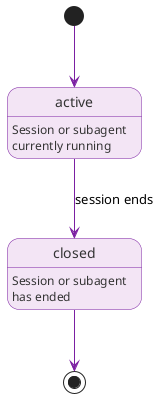

# Agents

## Overview

Agents (AGT-*) represent Claude Code sessions and subagents. Each invocation of Claude Code creates a new Agent node, making agents ephemeral; they track a specific execution context rather than a persistent identity. Krav captures the distinction between session agents and subagents through the `sessionId` (always required) and `subagentId` (null for main session agents, set for subagents spawned within a session).

## Purpose

Agents provide fine-grained provenance for automated work. When a Claude Code session creates a requirement, modifies a task, or produces a defect, the `attributedTo` property on those nodes points at the AGT-* that performed the action. Combined with the `operator` link to the dev who initiated the session, this creates a full chain: human actor → agent session → graph modifications.

Subagent tracking matters because Claude Code can spawn subagents for parallel work. When a session delegates a task to a subagent, the `parentAgent` link records that delegation. Queries can then distinguish between work done by the main session and work delegated to subagents.

The hook system can populate `sessionId` and `subagentId` automatically from Claude Code session metadata, so agent nodes are typically created without manual intervention.

## Lifecycle

Agents have a minimal lifecycle:

```text
active → closed
```



| State | Description |
|-------|-------------|
| active | The session or subagent is currently running |
| closed | The session or subagent has ended |

Agent nodes are never deleted. Even after a session closes, the AGT-* node remains as a historical record for provenance queries.

## Storage model

Krav stores agent vertex data in the `agents` table (`agents.ndjson` on disk). Edge tables hold all relationships separately.

### Session agent

```json
{"id": "AGT-M5V9K3X7", "type": "Agent", "title": "Session 2026-01-15T14:30:00Z", "sessionId": "cc-sess-a1b2c3d4", "subagentId": null, "status": "closed", "startedAt": "2026-01-15T14:30:00Z", "endedAt": "2026-01-15T15:45:00Z"}
```

With edge in `operator.ndjson`: `{"src": "AGT-M5V9K3X7", "dst": "DEV-J4R8T2W6"}`

### Subagent

```json
{"id": "AGT-SUB4G3NT", "type": "Agent", "title": "Subagent: implement parser tests", "sessionId": "cc-sess-a1b2c3d4", "subagentId": "sub-e5f6g7h8", "status": "closed", "startedAt": "2026-01-15T14:45:00Z", "endedAt": "2026-01-15T15:10:00Z"}
```

With edges: `parent_agent` → AGT-M5V9K3X7, `operator` → DEV-J4R8T2W6.

Fields:

- `id`: Unique identifier (AGT-XXXXXXXX format)
- `type`: Always "Agent"
- `title`: Human-readable label (typically includes timestamp or task context)
- `description`: What this session or subagent was doing (optional)
- `sessionId`: Claude Code session identifier (required)
- `subagentId`: Subagent identifier within the session (null for main session agent)
- `status`: Lifecycle state (active, closed)
- `startedAt`: ISO 8601 timestamp when the session or subagent started
- `endedAt`: ISO 8601 timestamp when the session or subagent ended (null while active)
- `summary`: Inline prose for session notes or context (optional)
- `created`, `updated`: ISO 8601 timestamps
- `tags`: Array of strings (optional)

The `operator` and `parentAgent` predicates live in their respective edge tables.

Most agents are fully described by their structured fields. Agents that accumulate extensive session logs or notes can use a prose file at `.krav/agents/{timestamp}-{NANOID}-{slug}.md`. See [Prose files](../schema.md#prose-files) for the path convention.

## Relationships

### Outgoing relationships

| Property | Target | Cardinality | Description |
|----------|--------|-------------|-------------|
| operator | DEV-* | Single | Developer who initiated this session |
| parentAgent | AGT-* | Single | Session agent that spawned this subagent (subagents only) |

### Incoming relationships (queried via graph)

| Property | Source | Description |
|----------|--------|-------------|
| attributedTo | any | Nodes created or modified by this agent |
| parentAgent | AGT-* | Subagents spawned by this session agent |

## CLI commands

```bash
# CRUD
Krav agent create --session-id "cc-sess-a1b2c3d4" \
  --title "Session 2026-01-15T14:30:00Z" \
  --operator DEV-J4R8T2W6
Krav agent show AGT-M5V9K3X7
Krav agent list
Krav agent list --status active
Krav agent list --operator DEV-J4R8T2W6
Krav agent close AGT-M5V9K3X7

# Queries
Krav agent produced AGT-M5V9K3X7     # Nodes attributed to this agent
Krav agent subagents AGT-M5V9K3X7    # Subagents of this session agent
```

See Agent for full CLI documentation.

## Design notes

Agents are ephemeral by design. Each Claude Code invocation creates a fresh AGT-* node because session identity matters for provenance; knowing that two modifications happened in the same session is different from knowing they happened in separate sessions. The `sessionId` field captures Claude Code's own session identifier, while the Krav `id` (AGT-XXXXXXXX) provides a stable graph identity.

The `parentAgent` predicate is only valid when `subagentId` is non-null. A main session agent has no parent. This constraint is semantic rather than enforced by the schema; the schema allows any AGT-* to reference any other AGT-* via `parentAgent`, but the convention restricts it to the subagent relationship.

Both Developer and Agent align with `prov:Agent` in the vocabulary mapping. Krav's own code distinguishes them by `type`.
