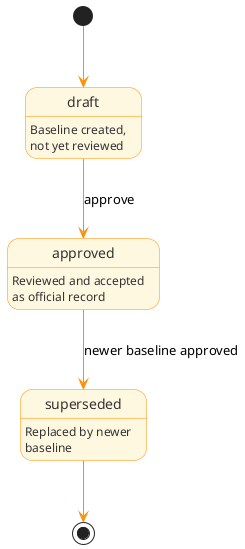

# Baselines

## Overview

Baselines (BSL-*) capture the state of the knowledge graph at a specific point in time. A baseline records which nodes existed, their states, and the relationships between them, anchored to a specific git commit. Baselines enable milestone recording, change auditing, regression detection, and phase gate enforcement.

Traditional RE tools treat baselines as snapshots of a requirements database. ARCI takes a lighter approach: since graph.jsonlt is version-controlled and append-only, the git history already contains every historical state. A baseline is a named reference into that history with metadata about why the team created it, what it covers, and who approved it.

## Purpose

Baselines serve multiple roles:

**Milestone recording**: a baseline freezes the graph state at a decision point, creating an unambiguous record of what existed when the team reached agreement at an architecture review.

**Change auditing**: semantic diff between baselines shows what changed in terms the project cares about (nodes added, modified, removed; relationships changed; phases advanced) rather than raw JSONLT line diffs.

**Phase gates**: phase advancement can require a baseline of the current phase before proceeding, so ARCI records the pre-advancement state for later review. The architecture baseline captures the agreed state before design begins; the design baseline captures the agreed state before coding starts.

**Regression detection**: comparing the current graph against a baseline reveals unintended changes. A requirement that existed in the architecture baseline but is missing now warrants investigation.

**Suspect link review**: baselines interact with suspect propagation. When reviewing suspect links, the baseline provides a reference point: `this link was valid at baseline X, what changed since then?`

## Storage model

ARCI stores baseline metadata in `graph.jsonlt` as JSON-LD compact form, like all other node types. The baseline record does not contain a full graph snapshot; it stores a git commit SHA that you can use to reconstruct the graph state at baseline time.

```json
{"@context": "context.jsonld", "@id": "BSL-R3L3AS31", "@type": "Baseline", "title": "Architecture baseline", "module": {"@id": "MOD-OAPSROOT"}, "scope": "subtree", "commitSha": "a1b2c3d4e5f6789...", "phase": "architecture", "status": "approved", "approvedBy": "tony", "approvedAt": "2026-02-28T16:00:00Z", "description": "Architecture phase complete for root module. All architecture tasks done, no blocking findings.", "statistics": {"modules": 5, "concepts": 12, "needs": 8, "requirements": 15, "verifications": 6, "tasks": 23, "findings": {"open": 0, "closed": 7}}}
```

Fields:

- `@id`: Unique identifier (BSL-XXXXXXXX format)
- `@type`: Always "Baseline"
- `title`: Human-readable title
- `module`: The module this baseline roots at
- `scope`: What the baseline covers (see Scope below)
- `commitSha`: Git commit SHA anchoring the graph state
- `phase`: The lifecycle phase this baseline captures (optional, for phase-gate baselines)
- `status`: Lifecycle state (see Lifecycle below)
- `approvedBy`: Who approved this baseline (optional)
- `approvedAt`: When the approver accepted it (optional)
- `description`: Why this baseline exists
- `summary`: Inline prose for extended context (detailed justification, scope decisions, known issues at baseline time; optional)
- `statistics`: Denormalized counts at baseline time (see Statistics below)
- `created`, `updated`: ISO 8601 timestamps
- `tags`: Array of strings (optional)

### Why git commit SHA, not a full snapshot?

The graph.jsonlt file is version-controlled. You can reconstruct any historical state by checking out graph.jsonlt at the baseline's commit SHA. This avoids duplicating the entire graph inside the baseline record (which would be expensive and redundant), while remaining fully reproducible.

The tradeoff: if git history is rewritten (force push, rebase) and the baseline's commit SHA becomes unreachable, the baseline is unresolvable. This is intentional, because it surfaces history tampering. Projects that need tamper-evident baselines should protect the branch containing `.arci/` from force pushes.

### Statistics

The `statistics` field captures a denormalized snapshot of graph counts at baseline time. This is redundant with the commit SHA (you could recompute it) but serves two purposes: quick inspection without materializing the historical graph, and detection of history tampering (if the reconstructed counts don't match the stored statistics, something changed).

```json
{
  "statistics": {
    "modules": 5,
    "concepts": 12,
    "needs": 8,
    "requirements": 15,
    "verifications": 6,
    "tasks": 23,
    "findings": {
      "open": 0,
      "acknowledged": 2,
      "addressed": 3,
      "closed": 7,
      "wont_fix": 1
    },
    "suspectLinks": 0,
    "verificationCoverage": 0.87
  }
}
```

The `verificationCoverage` field records the ratio of requirements that have at least one passing verification. The `suspectLinks` count records how many links ARCI marked suspect at baseline time; a healthy baseline should have zero.

## Prose files

Most baselines are adequately described by `description`. Baselines that mark major milestones or carry complex justifications (release baselines, phase gates with deferred defects, baselines with known caveats) may need a prose file at `.arci/baselines/{timestamp}-{NANOID}-{slug}.md`, with the path derived from the node's identifier. See [Prose files](../schema.md#prose-files) for the full convention.

## Scope

Baselines scope to an module subtree. The `scope` field indicates what's included:

**subtree** (default): the baseline covers the specified module and all its descendants, including all nodes owned by any module in the subtree (needs, requirements, verifications, tasks, findings) and all relationships between them. This is the common case: baseline a module to capture its complete state.

**module-only**: the baseline covers only the specified module's directly owned nodes, not descendants. Useful for component-level baselines where child modules are baselined independently.

The module field determines the root of the scope. Baselining the root module with `subtree` scope captures the entire project.

```bash
# Baseline the whole project
arci baseline create --module MOD-OAPSROOT --title "Architecture baseline"

# Baseline a subsystem
arci baseline create --module MOD-A4F8R2X1 --title "Parser design baseline" --scope subtree

# Baseline a single component
arci baseline create --module MOD-L3X3R001 --title "Lexer implementation baseline" --scope module-only
```

## Lifecycle

Baselines have a simple lifecycle:

```text
draft → approved → superseded
```



| State      | Description                                               |
|------------|-----------------------------------------------------------|
| draft      | Baseline created but not yet reviewed or approved         |
| approved   | Baseline reviewed and accepted as an official record      |
| superseded | A newer baseline for the same module and phase exists     |

State transitions:

- `draft → approved`: Baseline reviewed and approved, approvedBy and approvedAt set.
- `approved → superseded`: A newer baseline reaches approved status for the same module and phase. The older baseline remains in the graph for historical reference but is no longer the active baseline for that scope.

Draft baselines are useful when a phase gate requires a baseline but the team defers approval (the developer creates the baseline, then a reviewer approves it later). For solo projects or less formal workflows, the user can create baselines directly in `approved` status.

## Phase gate integration

Baselines integrate with module phase advancement. A hook policy can require a baseline of the current phase before advancing:

```yaml
policies:
  - name: require-baseline-before-advance
    description: Ensure the current phase is baselined before advancing
    match:
      tool: arci
      args:
        - match: "module"
          position: 0
        - match: "advance"
          position: 1
    conditions:
      - expr: >
          !baselines.exists(b,
            b.module == input.args.module &&
            b.phase == state.currentPhase &&
            b.status == 'approved')
    rules:
      - effect: deny
        message: "Create and approve a baseline for the current phase before advancing"
```

When phase advancement triggers a baseline:

1. The CLI commits any pending changes to graph.jsonlt
2. ARCI creates a BSL-* record with the current commit SHA
3. ARCI computes statistics from the current graph state
4. If the user enables auto-approve, the baseline enters `approved` status immediately
5. Phase advancement proceeds

The resulting baseline records exactly what existed when the module left that phase. Later, `arci baseline diff` can show what changed between phases.

### Cross-module synchronization

Since each module's phase is independent of its parent's and siblings' phases, baselines provide the mechanism for coordinating release readiness across module boundaries. A hook policy on the parent module's release baseline can require that all child modules have approved baselines at a target phase before the parent's baseline reaches approval. A root module's release baseline policy might require every child module to have an approved verification-phase baseline. This replaces the former hierarchical phase constraint with explicit, auditable policy: the parent doesn't gate children's progress, but the release process still enforces that children have reached the necessary maturity before the system ships.

## Semantic diff

The primary analytical operation on baselines is semantic diff: given two baselines (or a baseline and the current state), produce a structured comparison at the graph level.

### Reconstruction

To diff two baselines, ARCI materializes the graph at each commit:

1. Read graph.jsonlt at baseline A's commit SHA (via `git show <sha>:.arci/graph.jsonlt`)
2. Read graph.jsonlt at baseline B's commit SHA (or current working tree)
3. Materialize both into in-memory Graph instances
4. Scope each graph to the baseline's module subtree
5. Compute structural diff

### Diff output

The diff produces a structured result covering multiple dimensions.

Node changes identify nodes that the team added, modified, or removed between baselines. A modification is any change to a node's fields (status, statement, phase, etc.). The diff reports which fields changed and their old/new values.

Relationship changes identify links that the team added, removed, or modified (suspect flag set, budget changed, and similar). This is where suspect propagation becomes visible: a link that was healthy at baseline A but suspect at baseline B shows up here.

Phase changes show module phase transitions between baselines, which modules advanced, regressed, or remained unchanged.

Coverage changes show how verification coverage shifted: new requirements without verifications, newly verified requirements, verifications that changed status.

Statistics delta compares the aggregate counts between baselines.

### CLI output

```text
$ arci baseline diff BSL-4RCH0001 BSL-D3S1GN01

Comparing "Architecture baseline" → "Design baseline" for MOD-OAPSROOT
  Time span: 2026-01-15 → 2026-02-28
  Commit range: a1b2c3d..f6e5d4c

Nodes added (7):
  REQ-N3WR3Q01  "API response time < 50ms" (requirement, approved)
  REQ-N3WR3Q02  "Request ID in all responses" (requirement, approved)
  REQ-N3WR3Q03  "Structured error responses" (requirement, draft)
  TC-N3WV3R01  "Response time benchmark" (verification, ready)
  TASK-D3S1GN01  "Design parser API" (task, done)
  TASK-D3S1GN02  "Design error catalog" (task, done)
  DEF-R3V13W01  "Error catalog incomplete" (finding, addressed)

Nodes modified (3):
  NEED-B7G3M9K2  statement: "fast feedback" → "sub-second feedback"
  MOD-A4F8R2X1  phase: architecture → design
  MOD-OAPSROOT  phase: architecture → design

Nodes removed (1):
  CON-OLDCON01  "Alternative parser approach" (superseded)

Suspect links (1):
  REQ-C2H6N4P8 ←derivesFrom— NEED-B7G3M9K2
    Reason: NEED-B7G3M9K2 statement modified after link established

Coverage: 60% → 73% (+13%)
  Newly verified: REQ-C2H6N4P8
  Still unverified: REQ-N3WR3Q02, REQ-N3WR3Q03
```

## Relationships

### Outgoing relationships

| Property | Target | Cardinality | Description                                |
|----------|--------|-------------|--------------------------------------------|
| module   | MOD-*  | Single      | Root module this baseline covers           |

### Incoming relationships (queried via graph)

Baselines don't typically have incoming relationships from other node types. They serve as reference points for comparing graph state over time.

### Baseline-to-baseline ordering

Baselines for the same module and phase form a temporal sequence via their `created` timestamps and the superseded lifecycle state. The most recent approved, non-superseded baseline for a given module/phase pair is the "current" baseline for that scope.

## CLI commands

```bash
# Create
arci baseline create --module MOD-OAPSROOT --title "Architecture baseline"
arci baseline create --module MOD-OAPSROOT --title "Architecture baseline" \
  --phase architecture --auto-approve --approved-by tony

# List and show
arci baseline list
arci baseline list --module MOD-OAPSROOT
arci baseline list --module MOD-OAPSROOT --phase architecture
arci baseline show BSL-R3L3AS31

# Approve
arci baseline approve BSL-R3L3AS31 --approved-by tony

# Diff
arci baseline diff BSL-4RCH0001 BSL-D3S1GN01
arci baseline diff BSL-D3S1GN01              # Compare against current state

# Verify integrity
arci baseline verify BSL-R3L3AS31            # Check commit is reachable, statistics match
```

See [Baseline](../../cli/commands/baseline.md) for full CLI documentation.

## Interaction with other features

### Phase advancement

Phase advancement can optionally require an approved baseline. The user configures this via hook policy (see Phase gate integration in the preceding section) rather than embedding it in the advancement logic.

### Suspect links

When reviewing suspect links, baselines provide temporal context. The review finding can reference the baseline where the link was last known-good: `This link was valid at BSL-4RCH0001. NEED-B7G3M9K2 changed in commit f6e5d4c.`

### Findings

Baseline creation can itself produce findings. If there are open blocking findings or suspect links at baseline time, the create command can warn or (via hook policy) refuse to create the baseline until they're resolved.

### Templates

A baseline-creation task template could standardize the baselining process: review open findings, clear suspect links, run verification suite, create and approve baseline, advance phase.

## Examples

### Architecture phase gate baseline

```json
{"@context": "context.jsonld", "@id": "BSL-4RCH0001", "@type": "Baseline", "title": "Architecture baseline", "module": {"@id": "MOD-OAPSROOT"}, "scope": "subtree", "commitSha": "a1b2c3d4e5f6789abcdef0123456789abcdef01", "phase": "architecture", "status": "approved", "approvedBy": "tony", "approvedAt": "2026-01-15T14:30:00Z", "description": "Architecture phase complete. Module hierarchy established, key interfaces identified, architecture review findings all closed.", "statistics": {"modules": 5, "concepts": 12, "needs": 8, "requirements": 15, "verifications": 6, "tasks": 23, "findings": {"open": 0, "closed": 7}, "suspectLinks": 0, "verificationCoverage": 0.4}}
```

### Subsystem design baseline

```json
{"@context": "context.jsonld", "@id": "BSL-D3S1GN01", "@type": "Baseline", "title": "Parser design baseline", "module": {"@id": "MOD-A4F8R2X1"}, "scope": "subtree", "commitSha": "f6e5d4c3b2a19876543210fedcba9876543210fe", "phase": "design", "status": "approved", "approvedBy": "tony", "approvedAt": "2026-02-28T16:00:00Z", "description": "Parser API design finalized. All design tasks complete, API spec and data model documented.", "statistics": {"modules": 3, "concepts": 4, "needs": 3, "requirements": 8, "verifications": 5, "tasks": 11, "findings": {"open": 0, "closed": 4}, "suspectLinks": 0, "verificationCoverage": 0.625}}
```

### Draft baseline pending review

```json
{"@context": "context.jsonld", "@id": "BSL-1MPL0001", "@type": "Baseline", "title": "Implementation checkpoint", "module": {"@id": "MOD-A4F8R2X1"}, "scope": "subtree", "commitSha": "1234567890abcdef1234567890abcdef12345678", "status": "draft", "description": "Implementation checkpoint before refactoring parser internals."}
```

## Implementation status

| Layer | Status | Notes |
|-------|--------|-------|
| Core | Not yet | BaselineNode, operations, queries, diff |
| IO | Not yet | Git commit reading, baseline serialization |
| Service | Not yet | Create, approve, diff orchestration |
| CLI | Not yet | Commands for create, list, show, approve, diff, verify |

## Summary

Baselines provide named references into git history that capture the knowledge graph state at specific points:

- Anchored to git commit SHAs rather than full graph snapshots
- Scoped to module subtrees for targeted baselining
- Integrated with phase gates via hook policies
- Semantic diff produces structured changelogs at the graph level (not JSONLT line diffs)
- Statistics snapshot enables quick inspection and integrity verification
- Temporal sequencing via lifecycle (draft → approved → superseded)
- Store metadata in graph.jsonlt; `summary` for inline context, prose files at derived paths for extended content
