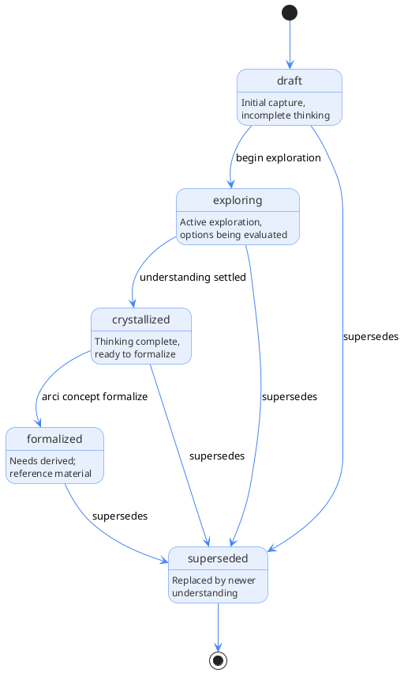

# Concepts

## Overview

Concepts (CON-*) are explorations of how something could work. They capture design thinking, architectural options, decisions made and their rationale, research findings, and any other crystallized thinking that informs the project.

In INCOSE terms, concepts are "lifecycle concepts," the raw material from which the team derives needs through formal transformation. A concept represents exploration and understanding; a need represents a formalized stakeholder expectation extracted from that understanding.

## Purpose

Concepts serve multiple roles:

**Exploration space**: before committing to requirements, teams explore options. Concepts provide a place to think through alternatives, tradeoffs, and implications without the formality of requirements.

**Decision capture**: when teams make architectural or design decisions, concepts record the decision, the alternatives the team considered, and the reasoning. This prevents relitigating settled questions.

**Research repository**: teams can capture technical research, spike findings, proof-of-concept results, and external reference material as concepts.

**Transformation source**: when a concept crystallizes, it becomes the source for formal transformation into needs. The derivesFrom relationship maintains traceability from needs back to the concepts that informed them.

## Lifecycle

Concepts progress through states:

```text
draft → exploring → crystallized → formalized → superseded
```



| State        | Description                                            |
|--------------|--------------------------------------------------------|
| draft        | Initial capture, incomplete thinking                   |
| exploring    | Active exploration, evaluating options                 |
| crystallized | Thinking complete, ready to formalize into needs       |
| formalized   | ARCI derived needs from this; concept is reference material |
| superseded   | Replaced by newer understanding                        |

State transitions:

- `draft → exploring`: Work begins on fleshing out the concept
- `exploring → crystallized`: Exploration complete, understanding settled
- `crystallized → formalized`: the user ran `arci concept formalize`
- `* → superseded`: New concept replaces this one (via supersedes relationship)

## Concept types

The `conceptType` field categorizes the nature of the exploration:

| Type          | Description                                             | Examples                                              |
|---------------|---------------------------------------------------------|-------------------------------------------------------|
| architectural | System structure, module boundaries, decomposition      | `Parser subsystem architecture`, `Service boundaries` |
| operational   | How stakeholders use, operate, or experience the system | `CLI user workflows`, `Error recovery experience`     |
| technical     | Internal mechanisms, algorithms, data structures        | `Tokenization algorithm`, `Graph storage format`      |
| interface     | Contracts between components, APIs, protocols           | `Parser-CLI interface`, `Plugin API design`           |
| process       | Workflows, procedures, ways of working                  | `Release process`, `Code review workflow`             |
| integration   | Connections with external systems and standards         | `INCOSE alignment`, `Git integration`                 |

## Storage model

ARCI stores concept vertex data in the `concepts` table (`concepts.ndjson` on disk). Edge tables hold all relationships separately.

```json
{"id": "CON-C0NC3PT5", "type": "Concept", "title": "Parser architecture", "status": "exploring", "conceptType": "architectural"}
```

The `informs` relationship to a module lives in the `informs.ndjson` edge table:

```json
{"src": "CON-C0NC3PT5", "dst": "MOD-P4RS3R01"}
```

Fields:

- `id`: Unique identifier (CON-XXXXXXXX format)
- `type`: Always "Concept"
- `title`: Human-readable title
- `description`: Brief description (optional)
- `status`: Lifecycle state (draft, exploring, crystallized, formalized, superseded)
- `conceptType`: Type of exploration (architectural, operational, technical, interface, process, integration)
- `created`, `updated`: ISO 8601 timestamps
- `tags`: Array of strings (optional)

## Prose files

Concepts almost always have a prose file since exploration is their purpose. The file lives at `.arci/concepts/{timestamp}-{NANOID}-{slug}.md`, with the path derived from the node's identifier rather than stored on the node. See [Prose files](../schema.md#prose-files) for the full convention.

Concept prose files have flexible structure, but commonly include:

```markdown
# Parser architecture

## Context

What situation or problem prompted this exploration?

## Options considered

### Option A: Recursive descent

Description, pros, cons...

### Option B: PEG parser

Description, pros, cons...

## Decision

What was decided and why?

## Implications

What follows from this decision? What constraints does it impose?

## Open questions

What remains unresolved?
```

For research/spike concepts:

```markdown
# Tokenization performance spike

## Goal

What were we trying to learn?

## Approach

What did we try?

## Findings

What did we learn?

## Recommendations

What should we do based on this?
```

## Relationships

Edge tables hold all relationships. Each edge table row has `src` and `dst` columns identifying the source and target nodes.

### Outgoing relationships

| Property     | Target | Cardinality | Description                            |
|--------------|--------|-------------|----------------------------------------|
| derivesFrom  | CON-*  | Multi       | This concept builds on other concepts  |
| supersedes   | CON-*  | Single      | This concept replaces an older one     |
| informs      | MOD-*  | Single      | Module this concept informs (informal) |

### Incoming relationships (queried via graph)

| Property     | Source | Description                           |
|--------------|--------|---------------------------------------|
| derivesFrom  | NEED-*  | Needs derived from this concept       |
| derivesFrom  | CON-*  | Other concepts that build on this one |
| supersedes   | CON-*  | Concept that replaced this one        |

Example vertex record and associated edge table rows:

```json
{"id": "CON-N3W3R001", "type": "Concept", "title": "Refined architecture", "status": "draft", "conceptType": "architectural"}
```

In `derives_from.ndjson`:

```json
{"src": "CON-N3W3R001", "dst": "CON-0LD3R001"}
{"src": "CON-N3W3R001", "dst": "CON-SP1K3456"}
```

In `supersedes.ndjson`:

```json
{"src": "CON-N3W3R001", "dst": "CON-D3PR3C8D"}
```

In `informs.ndjson`:

```json
{"src": "CON-N3W3R001", "dst": "MOD-P4RS3R01"}
```

## Formalization

When a concept crystallizes, formalization extracts stakeholder expectations as needs:

```bash
arci concept formalize CON-C0NC3PT5
```

This interactive process:

1. Identifies stakeholders affected by the concept
2. For each stakeholder, extracts expectations
3. Creates NEED-* records with derivesFrom relationships back to the concept
4. Transitions the concept to `formalized` state

A single concept may produce multiple needs for different stakeholders or different aspects of the same stakeholder's expectations.

## CLI commands

```bash
# CRUD
arci concept create --title "Parser architecture" --type architectural
arci concept show CON-C0NC3PT5
arci concept list
arci concept list --status exploring --type architectural
arci concept update CON-C0NC3PT5 --status crystallized
arci concept delete CON-C0NC3PT5

# Lifecycle
arci concept transition CON-C0NC3PT5 --to crystallized
arci concept formalize CON-C0NC3PT5

# Relationships
arci concept link CON-C0NC3PT5 --supersedes CON-0LD3R123
arci concept link CON-C0NC3PT5 --informs MOD-P4RS3R01
```

See [Concept](../../cli/commands/concept.md) for full CLI documentation.

## Examples

### Architectural concept

```json
{"id": "CON-K7M3NP2Q", "type": "Concept", "title": "arci data model", "status": "crystallized", "conceptType": "architectural"}
```

With an `informs` edge: `{"src": "CON-K7M3NP2Q", "dst": "MOD-OAPSROOT"}`

### Technical spike

```json
{"id": "CON-SP1K3456", "type": "Concept", "title": "JSONLT performance characteristics", "status": "formalized", "conceptType": "technical"}
```

### Process concept with derivation

```json
{"id": "CON-PR0C3SS1", "type": "Concept", "title": "Phase-gated execution model", "status": "exploring", "conceptType": "process"}
```

With a `derives_from` edge: `{"src": "CON-PR0C3SS1", "dst": "CON-K7M3NP2Q"}`

## Relationship to modules

Concepts can have an informal `informs` relationship to modules, indicating which module the concept is primarily about. This is distinct from the formal derivation chain (CON → NED → REQ).

```text
CON-parser-arch (informs: MOD-parser)
    ↓ formalize
NEED-parser-performance (module: MOD-parser)
NEED-parser-extensibility (module: MOD-parser)
```

The `informs` relationship is for navigation and documentation. The `module` field on needs is the formal ownership relationship.

## Summary

Concepts capture exploration and crystallized thinking:

- Progress from draft through exploring to crystallized
- Typed by nature of exploration (architectural, technical, process, etc.)
- Stored as rows in the `concepts` vertex table (`.arci/graph/concepts.ndjson` on disk)
- Formalize into needs via `arci concept formalize`
- Maintain traceability via derivesFrom relationships
- Can inform modules via informal `informs` relationship
- Implemented following three-layer architecture (core/io/service)
