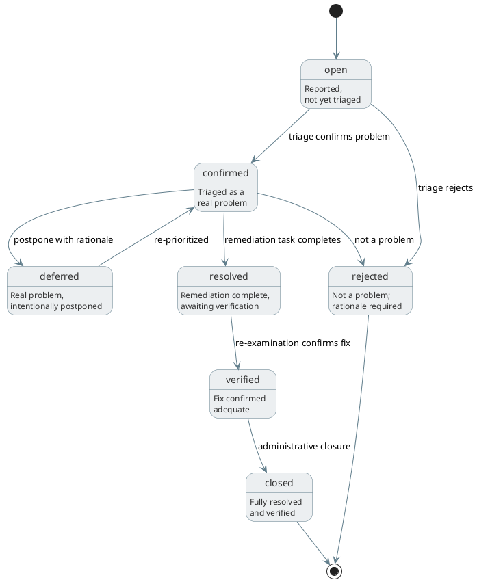

# Defects

## Overview

Defects (DEF-*) represent identified problems: deviations from requirements, standards, or expectations discovered during review, verification, analysis, or any examination activity. A defect records what's wrong, how severe it is, how the team dispositioned it, and how the team resolved it.

Defects replace the earlier Findings design (DEF-*), which conflated five distinct concerns (issues, recommendations, questions, decisions, observations) under one entity type. The redesign narrows the scope to actual problems, moves decisions to concepts (CON-*), and pushes questions and observations out of the knowledge graph into task context and review deliverables where they belong.

The design draws on IEEE 1028 (Software Reviews and Audits), which defines a defect as "any condition that deviates from expectations based on requirements specifications, design documents, user documents, standards, etc." ISO 15288 uses the term "non-conformance" for the same concept. CMMI uses "defect" throughout its verification and validation process areas.

## Purpose

Defects serve three roles.

**Problem tracking**: a defect is a problem that needs action. It has severity, it has an owner (the module where the team found it), it traces to what's wrong and what examination found it. This is the minimum viable tracking needed to manage quality without an external issue tracker.

**Phase gate enforcement**: open defects of sufficient severity block module phase advancement. The team must resolve or explicitly defer critical and major defects before a module can advance. This is the enforcement mechanism that gives phase gates teeth.

**Process feedback**: defects carry metadata about when and where the team found them (which phase, which review, which module). Over time, this data reveals process gaps. Defects found in verification that originated in architecture indicate the architecture review missed something. This is defect causal analysis, a core CMMI practice.

## What defects are not

Defects are not decisions. A decision is a committed choice with rationale and alternatives considered; that's a concept (CON-*) with concept_type capturing the category (architectural, technical, process, etc.). Decisions don't have severity, don't need remediation, and don't block phase advancement. They get made, not fixed.

Defects are not questions. A question during review is a blocker on the review task, captured in the task's context or the review report deliverable. If a question reveals an actual problem, the problem becomes a defect. The question itself doesn't need a lifecycle in the knowledge graph.

Defects are not neutral observations. Notes, commentary, and "things to keep in mind" go in review report deliverables as prose. If an observation later turns out to be a problem, it becomes a defect at that point.

Defects are not recommendations. A suggestion for improvement that isn't actually wrong doesn't need defect-level tracking. Recommendations go in review deliverables. If a recommendation is important enough to track, it becomes a need (NEED-*), a stakeholder expectation for how the system should improve.

## Defect categories

The `category` field captures what kind of problem the team found. These categories come from standard RE defect taxonomies and tell you *what's wrong*, not just that something turned up:

| Category        | Description                                               |
|-----------------|-----------------------------------------------------------|
| missing         | Something that should exist but doesn't                   |
| incorrect       | Something exists but contains errors                      |
| ambiguous       | Multiple valid interpretations are possible               |
| inconsistent    | Contradicts another requirement, design, or code          |
| non-verifiable  | No one can test or measure the requirement as stated      |
| non-traceable   | No upstream link to a need or parent requirement          |
| incomplete      | Partially specified, missing necessary detail              |
| superfluous     | Unnecessary, adds complexity without value                 |
| non-conformant  | Code deviates from an approved requirement                 |
| regression      | Previously passing verification now fails                  |

Not every defect needs a category; it's optional. But categorized defects enable aggregate analysis: `ambiguous` defects appearing repeatedly in requirements suggests the derivation process needs tightening.

## Severity

Severity indicates impact and urgency:

| Severity | Description                                    | Phase gate   |
|----------|------------------------------------------------|--------------|
| critical | System cannot function, data loss, safety risk | Blocks       |
| major    | Large capability gap or wrong behavior          | Blocks       |
| minor    | Small problem, workaround exists               | Does not block |
| trivial  | Cosmetic, negligible impact                    | Does not block |

Critical and major defects block module phase advancement by default. Hook policy can adjust this default; a project might decide that all open defects block, or that only critical defects block.

## Lifecycle

Defects have two distinct lifecycle concerns: disposition (is this a real problem?) and resolution (how did the team fix it?). The status field captures both as a single linear progression, but the transitions encode the two-phase nature.

```text
open → confirmed → resolved → verified → closed
         ↓
      rejected (with rationale)
      deferred (with rationale and target)
```



| State    | Description                                                    |
|----------|----------------------------------------------------------------|
| open     | Reported but not yet triaged                                   |
| confirmed| Triaged as a real problem, remediation needed                  |
| rejected | Not a problem: duplicate, by-design, invalid, or out of scope |
| deferred | Real problem, intentionally postponed with rationale and target|
| resolved | Remediation work complete, awaiting verification               |
| verified | Fix confirmed adequate (re-review, re-test)                    |
| closed   | Defect fully resolved and verified                             |

State transitions:

- `open → confirmed`: Triage confirms this is a real problem.
- `open → rejected`: Triage determines this is not a problem. Rationale required.
- `confirmed → deferred`: Problem is real but the team justifies postponement. Rationale and deferral target (a baseline, phase, or milestone) required.
- `confirmed → resolved`: Remediation task completes.
- `resolved → verified`: Re-examination confirms the fix is adequate.
- `verified → closed`: Administrative closure.
- `deferred → confirmed`: Team picks up the deferred defect again (target reached or priority changed).

The linked remediation task completing typically drives the `confirmed → resolved` transition. The `resolved → verified` transition requires re-examination; either the original reviewer confirms the fix, or a verification re-runs and passes.

### Why separate confirmed from resolved?

In the original DEF-* design, the lifecycle was open → acknowledged → addressed → closed. This conflated triage with resolution. A confirmed defect with no remediation task yet has a different state than one where the team finished the fix but has not yet verified it. Separating these states gives better visibility into the defect pipeline: how many defects await triage? How many have confirmation but no assignment? How many have fixes awaiting verification?

### Why verified before closed?

A resolved defect isn't necessarily fixed correctly. The `verified` state requires someone (or some automated check) to confirm the fix is adequate. This prevents the pattern where a defect is `closed` but the fix introduced a new problem or didn't actually address the original issue. For automated verifications (method: test), ARCI can automate the `resolved → verified` transition when the relevant Tc node's `currentResult` returns to `pass`.

## Storage model

ARCI stores defect metadata in `graph.jsonlt` as JSON-LD compact form:

```json
{"@context": "context.jsonld", "@id": "DEF-F1L4T7W5", "@type": "Defect", "title": "Error messages missing line numbers", "module": {"@id": "MOD-A4F8R2X1"}, "category": "incomplete", "severity": "major", "status": "confirmed", "statement": "Error messages report the error type but not the source location, making it difficult to locate problems in input files", "detectedBy": {"@id": "TASK-R3V13W01"}, "detectedInPhase": "design", "subject": {"@id": "REQ-3RR0R001"}}
```

Fields:

- `@id`: Unique identifier (DEF-XXXXXXXX format)
- `@type`: Always "Defect"
- `title`: Short description of the problem
- `module`: Module where the team found the defect (required)
- `category`: Defect category (optional, see Defect categories)
- `severity`: critical, major, minor, trivial (required)
- `status`: Lifecycle state (see Lifecycle)
- `statement`: Full description of the problem
- `rationale`: For rejected/deferred: why the team chose this disposition (optional)
- `deferralTarget`: For deferred: what milestone, phase, or baseline triggers re-evaluation (optional)
- `summary`: Inline prose for extended context beyond the statement (optional)
- `resolutionNotes`: How the team fixed the defect (populated on resolution, optional)
- `detectedInPhase`: The module phase when the team found the defect (optional)
- `created`, `updated`: ISO 8601 timestamps
- `tags`: Array of strings (optional)

## Prose files

Most defects are fully described by `statement` and `summary`. For defects that need more room (reproduction procedures, analysis logs, environmental details), a prose file can live at `.arci/defects/{timestamp}-{NANOID}-{slug}.md`, with the path derived from the node's identifier. See [Prose files](../schema.md#prose-files) for the full convention.

## Relationships

### Outgoing relationships

| Property   | Target | Cardinality | Description                                  |
|------------|--------|-------------|----------------------------------------------|
| module     | MOD-*  | Single      | Module where the team found the defect       |
| subject    | any    | Single      | What the defect is about (the defective item)|
| detectedBy | TASK-*  | Single      | Examination task that found this defect      |
| generates  | TASK-*  | Single      | Remediation task created to fix this defect  |

### Incoming relationships (queried via graph)

| Property   | Source | Description                              |
|------------|--------|------------------------------------------|
| dependsOn  | TASK-* | Tasks that depend on this defect's remediation task |

### The subject relationship

`subject` replaces the old `regarding` predicate. It points at the defective node: the requirement that's ambiguous, the module whose interface is incomplete, the verification that's inadequate. Unlike `regarding` (which left the relationship meaning unclear), `subject` carries a specific semantic: `this node has a problem`.

`subject` can target any node type:

```json
{"@id": "DEF-AMB1GU01", "subject": {"@id": "REQ-C2H6N4P8"}, "category": "ambiguous", "statement": "Requirement says 'quickly' without defining a threshold"}
{"@id": "DEF-M1SS1NG1", "subject": {"@id": "MOD-A4F8R2X1"}, "category": "missing", "statement": "No error handling defined for malformed input"}
{"@id": "DEF-N0NTR4C1", "subject": {"@id": "REQ-N3WR3Q01"}, "category": "non-traceable", "statement": "Requirement has no derivesFrom link to any need"}
```

### The detectedBy relationship

`detectedBy` points at the task that found the defect. This gives traceability from defect back to examination activity, showing which review or verification discovered this problem. It enables questions like `what did the architecture review find?` (all DEF-* where detectedBy points at the review task).

When an agent finds a defect outside a formal review (say, during coding), the user can omit `detectedBy`. The defect still exists and tracks through its lifecycle; it just doesn't trace back to a specific examination activity.

### The generates relationship

When a confirmed defect needs work, `generates` links to the remediation task. This is the same pattern as the old DEF-* design. The remediation task, when complete, drives the defect from `confirmed` to `resolved`.

```json
{"@id": "DEF-F1L4T7W5", "generates": {"@id": "TASK-F1X00001"}, "status": "resolved"}
```

## Interaction with reviews

A review in ARCI is a verification-phase task (task_type: `architecture-review`, `design-review`, `code-review`, `requirements-review`). The review task produces two kinds of output:

**Review report** (task deliverable): a prose document capturing the review's analysis, observations, recommendations, and disposition. This is where neutral observations, suggestions, and commentary live. The report is a file in the module's deliverables directory.

**Defects** (DEF-* nodes): zero or more defect records for actual problems found. Each defect links back to the review task via `detectedBy`.

The review task also has a **disposition**, the review outcome. ARCI captures this in the review report deliverable rather than on the task node itself, since disposition is specific to reviews and doesn't apply to other task types. Dispositions follow IEEE 1028:

- **accepted**: reviewed item meets criteria, no blocking defects.
- **conditionally accepted**: reviewed item is acceptable once identified defects reach resolution. The conditions are the open defects.
- **not accepted**: reviewed item does not meet criteria, major rework needed.

Phase advancement checks review task dispositions: all review tasks for the current phase must be complete with acceptable dispositions (accepted or conditionally accepted with all conditions resolved).

## Interaction with verifications

When a TC-*'s `currentResult` changes to `fail`, that's a verification result, not automatically a defect. The agent or human executing the verification task decides whether a failure warrants a defect:

- Expected failure during development (test written before coding): no defect.
- Regression (previously passing, now failing): create a defect with category `regression`.
- New failure revealing a real problem: create a defect with the appropriate category.

A hook policy can enforce that verification failures are always accompanied by defects if the project needs that discipline:

```yaml
policies:
  - name: require-defect-for-verification-failure
    description: Verification failures must have an associated defect
    match:
      tool: arci
      args:
        - match: "verification"
          position: 0
        - match: "record"
          position: 1
    conditions:
      - expr: "input.args.status == 'failing'"
    rules:
      - effect: warn
        message: "Consider creating a defect for this verification failure"
```

## Interaction with baselines

Defects interact with baselines in two ways.

**Baseline creation**: a project can require (via hook policy) that no open blocking defects exist before creating or approving a baseline, so baselines represent clean states.

**Deferral targets**: deferred defects can reference a baseline or phase as their target: `fix this before the design baseline`. The `deferralTarget` field captures this. When the team prepares the target baseline, deferred defects targeting it surface as items that need resolution or explicit re-deferral.

## Interaction with suspect links

Suspect links don't auto-generate defects. When a node modification sets the `suspect` flag on downstream relationships, those suspect links appear in the suspect link view. A reviewer examines each one and takes one of three actions: clears the flag (the link is still valid), creates a defect (something is actually wrong), or updates the downstream node (minor adjustment, no defect needed).

This avoids flooding the defect list with auto-generated items that may not be real problems. A changed need doesn't necessarily invalidate its derived requirements.

## Automatic defect creation

Some operations create defects automatically:

**Phase regression**: when a module regresses to an earlier phase, ARCI creates a defect to record why:

```json
{"@context": "context.jsonld", "@id": "DEF-R3GR3SS1", "@type": "Defect", "title": "Module boundary unclear", "module": {"@id": "MOD-A4F8R2X1"}, "severity": "major", "status": "confirmed", "statement": "Boundary between lexer and tokenizer is unclear, causing interface confusion", "category": "ambiguous", "detectedInPhase": "design", "subject": {"@id": "MOD-A4F8R2X1"}}
```

This is one of the few cases where automatic creation justifies itself; phase regression is always a major event that needs a tracked reason.

## CLI commands

```bash
# CRUD
arci defect create --module MOD-A4F8R2X1 --severity major \
  --statement "Error messages don't include source location" \
  --subject REQ-3RR0R001 --category incomplete
arci defect show DEF-F1L4T7W5
arci defect list
arci defect list --module MOD-A4F8R2X1 --severity critical --status open
arci defect update DEF-F1L4T7W5 --severity critical
arci defect delete DEF-F1L4T7W5

# Disposition
arci defect confirm DEF-F1L4T7W5
arci defect reject DEF-F1L4T7W5 --rationale "By design: errors use structured output"
arci defect defer DEF-F1L4T7W5 --rationale "Low priority for v1" --target "v2.0"

# Resolution
arci defect generate-task DEF-F1L4T7W5
arci defect resolve DEF-F1L4T7W5 --notes "Added line/column to all error types"
arci defect verify DEF-F1L4T7W5
arci defect close DEF-F1L4T7W5
arci defect reopen DEF-F1L4T7W5

# Queries
arci defect open                           # All open/confirmed defects
arci defect open --module MOD-A4F8R2X1     # Open for module
arci defect blocking                       # Defects blocking phase advancement
arci defect deferred                       # All deferred defects
arci defect by-review TASK-R3V13W01         # Defects from a specific review
arci defect by-subject REQ-C2H6N4P8        # Defects about a specific node
arci defect by-category ambiguous          # Defects by category
arci defect summary                        # Aggregate counts by status/severity
```

See [Defect](../../cli/commands/defect.md) for full CLI documentation.

## Examples

### Incomplete requirement found during design review

```json
{"@context": "context.jsonld", "@id": "DEF-F1L4T7W5", "@type": "Defect", "title": "Error messages missing source location", "module": {"@id": "MOD-A4F8R2X1"}, "category": "incomplete", "severity": "major", "status": "confirmed", "statement": "Error messages report the error type but not the line/column, making it difficult to locate problems in input files", "subject": {"@id": "REQ-3RR0R001"}, "detectedBy": {"@id": "TASK-R3V13W01"}, "detectedInPhase": "design"}
```

### Regression found during verification

```json
{"@context": "context.jsonld", "@id": "DEF-R3GR3SS1", "@type": "Defect", "title": "Parser latency regression", "module": {"@id": "MOD-A4F8R2X1"}, "category": "regression", "severity": "critical", "status": "confirmed", "statement": "Parser p99 latency increased from 42ms to 67ms after refactoring, exceeding the 50ms requirement", "subject": {"@id": "REQ-C2H6N4P8"}, "detectedBy": {"@id": "TASK-V3R1FY02"}, "detectedInPhase": "verification", "generates": {"@id": "TASK-F1XP3RF1"}}
```

### Ambiguous requirement found during architecture review

```json
{"@context": "context.jsonld", "@id": "DEF-AMB1GU01", "@type": "Defect", "title": "Requirement uses vague threshold", "module": {"@id": "MOD-A4F8R2X1"}, "category": "ambiguous", "severity": "minor", "status": "resolved", "statement": "REQ-P3RF0RM1 says 'quickly' without defining a measurable threshold", "subject": {"@id": "REQ-P3RF0RM1"}, "detectedBy": {"@id": "TASK-4RCHR3V1"}, "detectedInPhase": "architecture", "resolutionNotes": "Updated requirement to specify 'within 50ms at p99'"}
```

### Deferred defect

```json
{"@context": "context.jsonld", "@id": "DEF-D3F3RR01", "@type": "Defect", "title": "No Windows line ending support", "module": {"@id": "MOD-OAPSROOT"}, "category": "missing", "severity": "minor", "status": "deferred", "statement": "Parser does not handle \\r\\n line endings", "subject": {"@id": "MOD-A4F8R2X1"}, "rationale": "Windows support is out of scope for initial release", "deferralTarget": "v2.0"}
```

### Rejected defect

```json
{"@context": "context.jsonld", "@id": "DEF-R3J3CT01", "@type": "Defect", "title": "JSON output missing pretty-print", "module": {"@id": "MOD-B9G3M7K2"}, "severity": "trivial", "status": "rejected", "statement": "JSON output from CLI is compact, not pretty-printed", "subject": {"@id": "MOD-B9G3M7K2"}, "rationale": "By design: compact JSON is better for piping. Users can pipe through jq for pretty-printing."}
```

## Summary

Defects represent identified problems that need action:

- Scoped to actual deviations from requirements, standards, or expectations
- Categorized by what's wrong (missing, incorrect, ambiguous, regression, etc.)
- Severity-graded with critical/major blocking phase advancement
- Lifecycle separates disposition (is this real?) from resolution (did the team fix it?)
- Traced to the defective item via `subject` and the examination that found it via `detectedBy`
- Remediated through generated tasks, verified before closure
- Interact with baselines (clean baselines require no open blocking defects) and suspect links (reviewers create defects when suspect links reveal real problems)
- Store metadata in graph.jsonlt; `summary` for inline context, prose files at derived paths for extended content
- Do not contain decisions, questions, observations, or recommendations; those belong in concepts, task context, and review deliverables respectively
