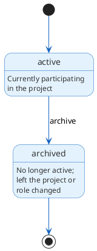

# Developers

## Overview

Developers (DEV-*) are human actors who initiate Claude Code sessions, approve baselines, and make design decisions. They provide persistent identity across sessions so that `attributedTo` and `operator` predicates have proper graph targets rather than opaque string fields.

## Purpose

Developers anchor the human side of provenance. When the graph records that a developer created a requirement or approved a baseline, the `attributedTo` property points at a DEV-* node rather than a freeform name. This enables queries like "what did this developer produce?" and "who approved this baseline?" without relying on string matching against git author fields.

Developers also serve as the target of the `operator` predicate on Agent nodes. Every Claude Code session starts from a developer; the `operator` link makes that relationship explicit and queryable.

## Lifecycle

Developers have a minimal lifecycle:

```text
active → archived
```



| State | Description |
|-------|-------------|
| active | This developer is currently participating in the project |
| archived | This developer is no longer active (left the project, role changed, etc.) |

Archiving a developer does not invalidate provenance links. Nodes attributed to the developer and agent sessions linked via `operator` remain valid historical records.

## Storage model

Krav stores developer vertex data in the `developers` table (`developers.ndjson` on disk). Developers have no outgoing relationship properties; agents reference them via the `operator` edge table, and any node can reference them via the `attributed_to` property.

```json
{"id": "DEV-J4R8T2W6", "type": "Developer", "title": "Tony", "description": "Primary developer and project maintainer", "status": "active"}
```

Fields:

- `id`: Unique identifier (DEV-XXXXXXXX format)
- `type`: Always "Developer"
- `title`: Human-readable name for this developer
- `description`: Role or relationship to the project (optional)
- `summary`: Inline prose for extended context (optional)
- `status`: Lifecycle state (active, archived)
- `created`, `updated`: ISO 8601 timestamps
- `tags`: Array of strings (optional)

Developers have no type-specific properties beyond the common fields. They are intentionally lightweight; the value is in their graph relationships (provenance links and operator references).

Most developers are fully described by `title` and `description`. Developers that accumulate extensive context can use a prose file at `.krav/developers/{timestamp}-{NANOID}-{slug}.md`. See [Prose files](../schema.md#prose-files) for the path convention.

## Relationships

### Incoming relationships (queried via graph)

| Property | Source | Description |
|----------|--------|-------------|
| operator | AGT-* | Agent sessions initiated by this developer |
| attributedTo | any | Nodes attributed to this developer |

Developers have no outgoing object properties to other graph nodes. Agents reference them via `operator`, and any node can reference them via `attributedTo`.

## CLI commands

```bash
# CRUD
Krav developer create --title "Tony" \
  --description "Primary developer and project maintainer"
Krav developer show DEV-J4R8T2W6
Krav developer list
Krav developer list --status active
Krav developer update DEV-J4R8T2W6 --description "Updated role"
Krav developer delete DEV-J4R8T2W6

# Lifecycle
Krav developer archive DEV-J4R8T2W6

# Queries
Krav developer sessions DEV-J4R8T2W6  # Show agent sessions for this developer
```

See Developer for full CLI documentation.

## Design notes

Developers are intentionally lightweight. They exist so that provenance properties (`attributedTo`, `operator`) reference proper graph nodes rather than string fields. A solo project might have a single DEV-* node. A team project creates one per contributor. Krav does not enforce linking developers to git authors or external identity providers; that mapping is a project-level convention, not a schema constraint.
