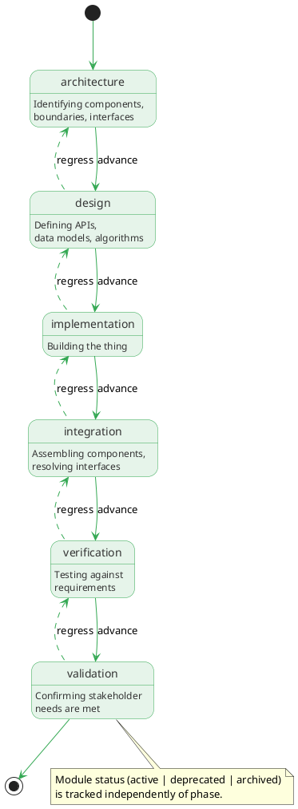

# Modules

## Overview

Modules (MOD-*) are architectural containers representing the things the team builds. A module could be a system, subsystem, component, module, or any identifiable element in the architecture. Modules form a hierarchy via parent-child relationships and serve as the organizing principle for needs, requirements, and work.

Unlike document-centric models where "specs" own requirements, Krav organizes around the architectural elements themselves. A module owns its needs and requirements; the module is what the team builds, constrains, and verifies.

## Purpose

Modules serve multiple roles:

**Architectural decomposition**: the module hierarchy represents how the system breaks down into subsystems, components, and modules. This decomposition is the primary structuring mechanism for the project.

**Ownership**: needs and requirements belong to modules. `The parser shall tokenize input in under 10 ms` is a requirement owned by MOD-parser, not floating in a document.

**Phase tracking**: each module tracks its current lifecycle phase (architecture, design, coding, etc.), enabling phase-gated execution where Krav constrains work to the appropriate phase.

**Work scoping**: tasks relate to modules. `What's the plan for the parser?` becomes a query over tasks where module is MOD-parser or its descendants.

**Deliverable organization**: the system organizes task outputs (architecture docs, API specs, code) by module in the filesystem.

## Hierarchy

Modules form a tree via childOf relationships:

```text
MOD-OAPSROOT (the project itself)
├── MOD-A4F8R2X1 (parser subsystem)
│   ├── MOD-L3X3R001 (lexer component)
│   └── MOD-T0K3N002 (tokenizer component)
├── MOD-B9G3M7K2 (CLI subsystem)
│   ├── MOD-C0MM4ND1 (command parser)
│   └── MOD-0UTPUT01 (output formatter)
└── MOD-K8G4R5X2 (knowledge graph subsystem)
```

The root module represents the project as a whole and owns project-wide needs and requirements.

### Hierarchy rules

- Every module except root has exactly one parent (single childOf relationship)
- Root module has no parent
- Cycles are not allowed
- Krav supports reparenting (with review of derived items)

## Lifecycle phase

Each module tracks its current phase:

```text
architecture → design → implementation → integration → verification → validation
```



| Phase          | Description                                    |
|----------------|------------------------------------------------|
| architecture   | Identifying components, boundaries, interfaces |
| design         | Defining APIs, data models, algorithms         |
| coding         | Building the thing                             |
| integration    | Assembling components, resolving interfaces    |
| verification   | Testing against requirements                   |
| validation     | Confirming stakeholder needs pass acceptance   |

### Phase constraints

Each module's phase is independent of its parent's and siblings' phases. A backend subsystem can reach verification while the frontend is still in design; a mature component can cycle through coding and verification for a new feature while the root module sits at integration. Cross-module coordination uses task dependencies (milestone tasks that depend on verification tasks across modules) and baseline policies (requiring child module baselines before creating a release baseline on the parent). A parent module's phase reflects the state of its own work, not the progress of its children.

**Task constraint**: the user can only create or execute tasks for the module's current phase or earlier phases.

### Phase advancement

```bash
Krav module advance MOD-A4F8R2X1 --to design
```

Advancement criteria:

- All tasks for the current phase are complete
- Verification tasks for the current phase have no blocking findings

### Phase regression

```bash
Krav module regress MOD-A4F8R2X1 --to architecture --reason "boundary unclear"
```

When a parent regresses:

- Regression does not affect child modules; each module's phase constraints are self-contained
- Krav automatically creates a finding (DEF-*) with the reason

## Storage model

Krav stores module vertex data in the `modules` table (`modules.ndjson` on disk). Edge tables hold all relationships separately.

```json
{"id": "MOD-A4F8R2X1", "type": "Module", "title": "Parser", "description": "Parses input into AST", "phase": "implementation", "status": "active"}
```

The `childOf` relationship lives in the `child_of.ndjson` edge table:

```json
{"src": "MOD-A4F8R2X1", "dst": "MOD-OAPSROOT"}
```

Fields:

- `id`: Unique identifier (MOD-XXXXXXXX format)
- `type`: Always "Module"
- `title`: Human-readable title
- `description`: Brief description (optional)
- `phase`: Current lifecycle phase
- `status`: active, deprecated, archived
- `summary`: Inline prose for extended context (architectural overview, component purpose, design rationale; optional)
- `created`, `updated`: ISO 8601 timestamps
- `tags`: Array of strings (optional)

The `childOf` and `integrates` predicates live in their respective edge tables.

## Stakeholder classes

Modules at different levels serve different stakeholder classes:

| Level     | Stakeholders                                        | Need examples                             |
|-----------|-----------------------------------------------------|-------------------------------------------|
| Root      | OSS community, contributors, maintainers, ecosystem | Stability, compatibility, discoverability |
| Subsystem | Domain users, integrators                           | Functionality, performance, extensibility |
| Component | Developers, adjacent components                     | API clarity, error handling, testability  |

## Relationships

Edge tables hold all relationships. Each edge table row has `src` and `dst` columns identifying the source and target nodes.

### Outgoing relationships

| Property   | Target | Cardinality | Description                                                |
| ---------- | ------ | ----------- | ---------------------------------------------------------- |
| childOf    | MOD-*  | Single      | This module's parent                                       |
| integrates | MOD-*  | Multi       | Peer modules this one integrates (for integration modules) |

### Incoming relationships (queried via graph)

| Property     | Source | Description                                            |
|--------------|--------|--------------------------------------------------------|
| childOf      | MOD-*  | Child modules                                         |
| allocatesTo  | REQ-*  | Requirements allocated to this module                  |
| module       | NEED-*  | Needs owned by this module                             |
| module       | REQ-*  | Requirements owned by this module                      |
| module       | TASK-*  | Tasks for this module                                  |
| informs      | CON-*  | Concepts that inform this module                       |

Example vertex record and associated edge table rows:

```json
{"id": "MOD-0BS3RV01", "type": "Module", "title": "Observability", "phase": "architecture", "status": "active"}
```

In `child_of.ndjson`: `{"src": "MOD-0BS3RV01", "dst": "MOD-OAPSROOT"}`

In `integrates.ndjson`:

```json
{"src": "MOD-0BS3RV01", "dst": "MOD-A4F8R2X1"}
{"src": "MOD-0BS3RV01", "dst": "MOD-B9G3M7K2"}
```

## Prose files

Modules can have a prose file for extended descriptions that go beyond `description` and `summary` (architectural overviews, component rationale, boundary justifications). The file lives at `.krav/modules/{timestamp}-{NANOID}-{slug}.md`, with the path derived from the node's identifier. See [Prose files](../schema.md#prose-files) for the full convention.

Module prose files are distinct from task deliverables (see below). The module's own prose describes what the module is and why it exists. Task deliverables are outputs of work done within the module's scope.

## Deliverable organization

Krav organizes task deliverables by module in subdirectories under `.krav/modules/`:

```text
.krav/
  modules/
    20260103164500-A4F8R2X1-parser.md        # Module's own prose file
    MOD-A4F8R2X1/
      architecture.md       # From architecture tasks
      api-design.md         # From design tasks
      interface-spec.md     # From design tasks
    MOD-B9G3M7K2/
      user-guide.md         # From documentation tasks
```

## Special modules

### Root module

Every project has a root module representing the project as a whole:

```json
{"id": "MOD-OAPSROOT", "type": "Module", "title": "krav", "description": "Krav", "phase": "implementation", "status": "active"}
```

Root-level needs capture project-wide stakeholder expectations. Root-level requirements flow down to child modules.

### Integration modules

Some modules represent integrations between siblings rather than components:

```json
{"id": "MOD-0BS3RV01", "type": "Module", "title": "Observability", "phase": "design", "status": "active"}
```

With edges: `child_of` → MOD-OAPSROOT, `integrates` → MOD-A4F8R2X1, `integrates` → MOD-B9G3M7K2.

Integration modules aren't constrained by sibling phases but their integration tasks may depend on sibling verification.

## CLI commands

```bash
# CRUD
Krav module create --title "Parser" --parent MOD-OAPSROOT
Krav module show MOD-A4F8R2X1
Krav module list
Krav module list --parent MOD-OAPSROOT --phase implementation
Krav module update MOD-A4F8R2X1 --title "Parser v2"
Krav module delete MOD-A4F8R2X1  # Must have no children

# Hierarchy
Krav module children MOD-OAPSROOT
Krav module tree MOD-OAPSROOT
Krav module reparent MOD-A4F8R2X1 --to MOD-B9G3M7K2

# Phase management
Krav module phase MOD-A4F8R2X1
Krav module advance MOD-A4F8R2X1 --to design
Krav module regress MOD-A4F8R2X1 --to architecture --reason "..."

# Work scoping
Krav module decompose MOD-A4F8R2X1 --template full-feature
Krav module tasks MOD-A4F8R2X1
Krav module tasks MOD-A4F8R2X1 --include-descendants

# Context
Krav context MOD-A4F8R2X1
```

See [Module](../../cli/commands/module.md) for full CLI documentation.

## Examples

### Root module

```json
{"id": "MOD-OAPSROOT", "type": "Module", "title": "krav", "description": "Krav", "phase": "implementation", "status": "active"}
```

### Subsystem module

```json
{"id": "MOD-A4F8R2X1", "type": "Module", "title": "Parser", "description": "Parses krav commands and configuration", "phase": "design", "status": "active", "tags": ["core"]}
```

With edge: `child_of` → MOD-OAPSROOT.

### Component module

```json
{"id": "MOD-L3X3R001", "type": "Module", "title": "Lexer", "description": "Tokenizes input stream", "phase": "architecture", "status": "active"}
```

With edge: `child_of` → MOD-A4F8R2X1.

## Summary

Modules are architectural containers that:

- Form a hierarchy representing system decomposition
- Own needs and requirements
- Track lifecycle phase independently with module-scoped advancement criteria
- Scope tasks and deliverables
- Serve as the primary organizing principle for the project
- Stored as rows in the `modules` vertex table (`.krav/graph/modules.ndjson` on disk)
- Implemented following three-layer architecture (core/io/service)

The module hierarchy replaces document-centric organization: the thing under construction is the organizing principle, not documents describing it.
