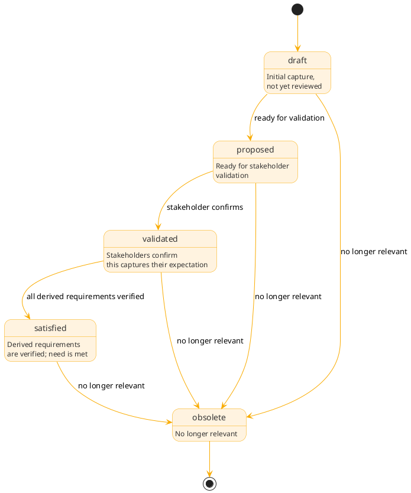

# Needs

## Overview

Needs (NEED-*) are stakeholder expectations, capturing what stakeholders need a module to do or be. They're expressed from the stakeholder's perspective and validated against stakeholder intent.

The key INCOSE distinction: a need is an "agreed-to expectation" while a requirement is an "agreed-to obligation." Needs express what stakeholders want; requirements express what the system must do to satisfy those needs.

## Purpose

Needs serve multiple roles:

**Stakeholder voice**: needs capture expectations in stakeholder terms, not coding terms. `Users need quick feedback when parsing` rather than `Parser shall complete in 10 ms`.

**Validation target**: needs require validation: did the team capture what stakeholders actually need? This is distinct from verification, which checks whether the system meets requirements.

**Derivation source**: requirements derive from needs. A single need may produce multiple requirements; a requirement may satisfy multiple needs. The derivesFrom relationship maintains traceability.

**Scope anchor**: when scope questions arise ("is this feature necessary?"), needs provide the answer by connecting back to stakeholder expectations.

## Needs vs requirements

| Aspect      | Need                                      | Requirement                 |
|-------------|-------------------------------------------|-----------------------------|
| Perspective | Stakeholder                               | System                      |
| Language    | `Users need`, `Contributors expect`       | `The system shall`          |
| Validation  | Validated (right thing captured?)         | Verified (built correctly?) |
| Precision   | May be qualitative                        | Must be verifiable          |
| INCOSE term | Agreed-to expectation                     | Agreed-to obligation        |

Example transformation:

```text
Need: "Users need quick feedback when parsing fails"
    ↓ derive
Requirement: "The parser shall report the first syntax error within 50ms"
Requirement: "Error messages shall include line number and column"
Requirement: "Error messages shall suggest corrections when possible"
```

## Lifecycle

Needs progress through states:

```text
draft → proposed → validated → satisfied → obsolete
```



| State     | Description                                          |
|-----------|------------------------------------------------------|
| draft     | Initial capture, not yet reviewed                    |
| proposed  | Ready for stakeholder validation                     |
| validated | Stakeholders confirm this captures their expectation |
| satisfied | Derived requirements pass verification; need fulfilled |
| obsolete  | No longer relevant (stakeholder needs changed)       |

State transitions:

- `draft → proposed`: Need is ready for validation
- `proposed → validated`: Stakeholder confirms this is what they need
- `validated → satisfied`: All derived requirements pass verification
- `* → obsolete`: Need is no longer relevant

## Stakeholder relationship

Each need references one or more stakeholders via the `stakeholder` object property. Stakeholders are project-defined STK-* nodes representing the actual parties who have expectations about the system. ARCI provides no fixed taxonomy of stakeholder types; each project defines whatever stakeholders make sense for its context.

A need may reference multiple stakeholders when they share the expectation. "The system shall produce machine-readable error output" might serve both a CI/CD pipeline operator and a tool integration developer. The `stakeholder` property is always an array of `{"@id": "STK-*"}` references, even when there's only one stakeholder.

See [Stakeholders](stakeholders.md) for the full STK-* node specification.

## Storage model

`graph.jsonlt` stores need metadata as JSON-LD compact form. Prose files contain no frontmatter;`graph.jsonlt` is the single source of truth for all structured data.

```json
{"@context": "context.jsonld", "@id": "NEED-B7G3M9K2", "@type": "Need", "title": "Quick parsing feedback", "module": {"@id": "MOD-A4F8R2X1"}, "stakeholder": [{"@id": "STK-H5N7P3Q9"}], "statement": "Users need quick feedback when parsing fails", "rationale": "Slow error reporting disrupts developer flow", "status": "validated", "priority": "must", "derivesFrom": [{"@id": "CON-K7M3NP2Q"}]}
```

Fields:

- `@id`: Unique identifier (NEED-XXXXXXXX format)
- `@type`: Always "Need"
- `title`: Human-readable title
- `module`: Module this need belongs to (required)
- `stakeholder`: Stakeholders who have this expectation (required, array of STK-* references)
- `statement`: The need statement in stakeholder terms
- `rationale`: Why this need exists (optional)
- `status`: Lifecycle state (draft, proposed, validated, satisfied, obsolete)
- `priority`: MoSCoW priority (must, should, could, wont)
- `summary`: Inline prose for extended context; background, research findings, stakeholder quotes (optional)
- `validationEvidence`: Evidence of stakeholder validation (optional)
- `created`, `updated`: ISO 8601 timestamps
- `tags`: Array of strings (optional)

## Prose files

The `statement`, `rationale`, and `validationEvidence` fields capture most needs. Needs backed by extensive user research, interview synthesis, or detailed stakeholder analysis may need a prose file at `.arci/needs/{timestamp}-{NANOID}-{slug}.md`, with the path derived from the node's identifier. See [Prose files](../schema.md#prose-files) for the full convention.

## Priority levels

Needs use MoSCoW prioritization:

| Priority | Description                                |
|----------|--------------------------------------------|
| must     | Essential; project fails without this      |
| should   | Important; high value, not critical        |
| could    | Desirable; nice to have if time permits    |
| wont     | Explicitly out of scope (for this release) |

## Relationships

ARCI embeds relationships in the need's JSON-LD record using `{"@id": "..."}` values.

### Outgoing relationships

| Property    | Target | Cardinality | Description                              |
|-------------|--------|-------------|------------------------------------------|
| module      | MOD-*  | Single      | Module this need belongs to              |
| stakeholder | STK-*  | Multi (1+)  | Stakeholders who have this expectation |
| derivesFrom | CON-*  | Multi       | Concepts that this need formalizes |

### Incoming relationships (queried via graph)

| Property    | Source | Description                          |
|-------------|--------|--------------------------------------|
| derivesFrom | REQ-*  | Requirements derived from this need  |
| derivesFrom | NEED-*  | Child needs (for need decomposition) |

Example with relationships:

```json
{"@context": "context.jsonld", "@id": "NEED-B7G3M9K2", "@type": "Need", "title": "Quick parsing feedback", "module": {"@id": "MOD-A4F8R2X1"}, "stakeholder": [{"@id": "STK-H5N7P3Q9"}], "statement": "Users need quick feedback when parsing fails", "status": "validated", "priority": "must", "derivesFrom": [{"@id": "CON-K7M3NP2Q"}, {"@id": "CON-P3RF0RM1"}]}
```

## Derivation

When stakeholders validate a need, derivation produces requirements:

```bash
arci need derive NEED-B7G3M9K2
```

This process:

1. Analyzes the need statement
2. Produces verifiable requirements that satisfy the need
3. Creates REQ-* records with derivesFrom relationships back to the need
4. Each requirement gets verification criteria

A single need typically produces 1-5 requirements. The team may decompose complex needs into child needs first.

## Validation

Validation confirms that the need accurately captures stakeholder expectations:

```bash
arci need validate NEED-B7G3M9K2 --evidence "User interviews Jan 2026"
```

Validation methods:

| Method      | Description                           |
|-------------|---------------------------------------|
| interview   | Direct stakeholder interviews         |
| survey      | Stakeholder surveys or questionnaires |
| observation | Observing stakeholder behavior        |
| prototype   | Stakeholder feedback on prototypes    |
| review      | Stakeholder review of need statements |

## CLI commands

```bash
# CRUD
arci need create --module MOD-A4F8R2X1 --stakeholder STK-H5N7P3Q9 \
  --statement "Users need quick feedback when parsing fails"
arci need show NEED-B7G3M9K2
arci need list
arci need list --module MOD-A4F8R2X1 --stakeholder STK-H5N7P3Q9
arci need update NEED-B7G3M9K2 --priority must
arci need delete NEED-B7G3M9K2

# Lifecycle
arci need transition NEED-B7G3M9K2 --to proposed
arci need validate NEED-B7G3M9K2 --evidence "..."
arci need derive NEED-B7G3M9K2

# Relationships
arci need link NEED-B7G3M9K2 --derives-from CON-K7M3NP2Q

# Traceability
arci need trace NEED-B7G3M9K2  # Show concept → need → requirements chain
```

See [Need](../../cli/commands/need.md) for full CLI documentation.

## Examples

### Single-stakeholder need

```json
{"@context": "context.jsonld", "@id": "NEED-B7G3M9K2", "@type": "Need", "title": "Quick parsing feedback", "module": {"@id": "MOD-A4F8R2X1"}, "stakeholder": [{"@id": "STK-H5N7P3Q9"}], "statement": "Users need quick feedback when parsing fails", "rationale": "Slow error reporting disrupts developer flow", "status": "validated", "priority": "must", "validationEvidence": "User interviews confirmed <3s threshold", "derivesFrom": [{"@id": "CON-K7M3NP2Q"}]}
```

### Multi-stakeholder need

```json
{"@context": "context.jsonld", "@id": "NEED-ERR0R002", "@type": "Need", "title": "Structured error output", "module": {"@id": "MOD-A4F8R2X1"}, "stakeholder": [{"@id": "STK-H5N7P3Q9"}, {"@id": "STK-1NT3GR8R"}], "statement": "The system needs machine-readable error output for automated processing", "rationale": "Enables both end-user tooling and CI/CD integration", "status": "validated", "priority": "must", "derivesFrom": [{"@id": "CON-K7M3NP2Q"}]}
```

### Project-level need

```json
{"@context": "context.jsonld", "@id": "NEED-3C0SYS01", "@type": "Need", "title": "Accurate package metadata", "module": {"@id": "MOD-OAPSROOT"}, "stakeholder": [{"@id": "STK-3C0SYS01"}], "statement": "The project needs accurate package metadata", "rationale": "Enables discovery and dependency resolution", "status": "validated", "priority": "must"}
```

## Relationship to concepts and requirements

Needs sit between concepts and requirements in the formal transformation chain:

```text
CON-* (exploration)
    ↓ formalize
NEED-* (expectation, validated)
    ↓ derive
REQ-* (obligation, verified)
```

Each transformation produces traceability via derivesFrom relationships:

```text
CON-K7M3NP2Q "Data model concept"
    ↑ derivesFrom
NEED-B7G3M9K2 "Users need quick feedback"
    ↑ derivesFrom
REQ-C2H6N4P8 "Parser shall report errors within 50ms"
```

This chain answers "why does this requirement exist?" by tracing back through needs to concepts.

## Summary

Needs capture stakeholder expectations:

- Expressed in stakeholder terms, not coding terms
- Validated against stakeholder intent
- Serve as derivation source for requirements
- Maintain traceability via derivesFrom relationships
- Progress from draft through validated to satisfied
- Store metadata in graph.jsonlt; `summary` for inline context, prose files at derived paths for extended content
- Implemented following three-layer architecture (core/io/service)

Needs are the bridge between exploration (concepts) and obligation (requirements), ensuring that what the system delivers traces back to what stakeholders actually need.
