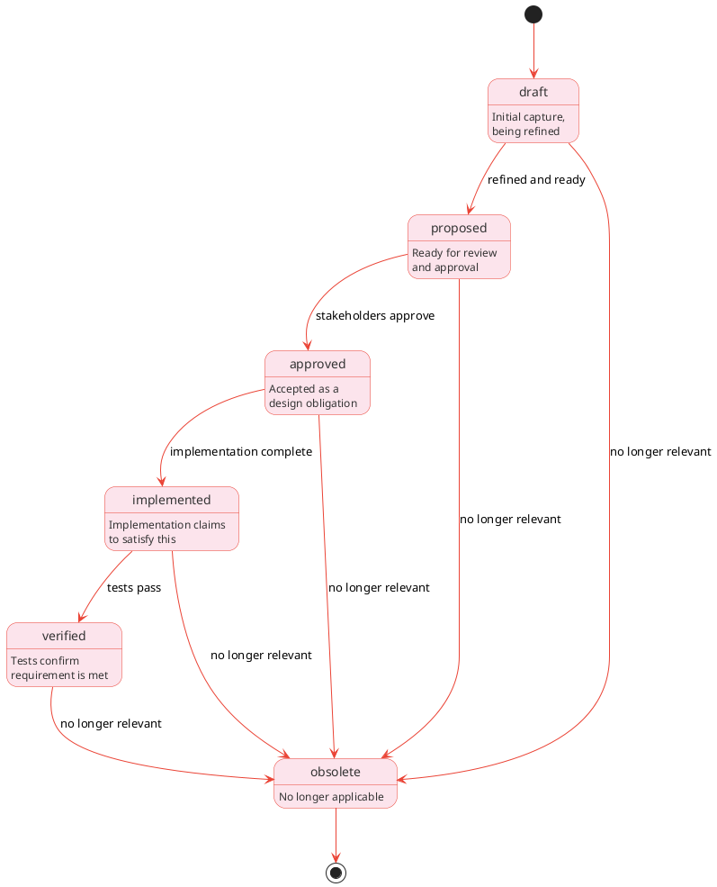

# Requirements

## Overview

Requirements (REQ-*) are design obligations, formal constraints on the system that, when satisfied, fulfill stakeholder needs. Unlike needs (stakeholder expectations), requirements state what the system shall do and must be verifiable.

In INCOSE terms, a requirement is "an agreed-to obligation." It's a contract: if the system meets this requirement, it satisfies (part of) a stakeholder need.

## Purpose

Requirements serve multiple roles:

**Design constraint**: requirements constrain design and coding choices. They're the `shall` statements that builds must satisfy.

**Verification target**: every requirement must be verifiable. Verifications (using test, inspection, analysis, or demonstration methods) provide evidence that the system meets requirements.

**Traceability anchor**: requirements link upward to needs (why does this exist?) and downward to verifications (how is this verified?). This bidirectional traceability is essential for understanding and maintaining the system.

**Flow-down mechanism**: parent module requirements allocate to child modules, creating derived requirements with budgets or partitions.

## Requirements vs needs

| Aspect      | Need                            | Requirement            |
|-------------|---------------------------------|------------------------|
| Perspective | Stakeholder                     | System                 |
| Language    | `Users need`                    | `The system shall`     |
| Precision   | Qualitative OK                  | Must be verifiable     |
| Owner       | Stakeholder                     | Design team            |
| Validation  | Was the right thing captured?   | Was it built right?    |

Example:

```text
Need: "Users need quick feedback when parsing fails"
    ↓
Requirement: "The parser shall report the first syntax error within 50ms"
```

## Lifecycle

Requirements progress through states:

```text
draft → proposed → approved → implemented → verified → obsolete
```



| State       | Description                           |
|-------------|---------------------------------------|
| draft       | Initial capture, undergoing refinement |
| proposed    | Ready for review and approval         |
| approved    | Accepted as a design obligation       |
| implemented | Code claims to satisfy this |
| verified    | Tests confirm the code meets the requirement |
| obsolete    | No longer applicable                  |

State transitions:

- `draft → proposed`: Requirement refined and ready for review
- `proposed → approved`: Stakeholders/reviewers approve
- `approved → implemented`: Implementation complete
- `implemented → verified`: Tests pass
- `* → obsolete`: Requirement no longer relevant

## Requirement qualities

Good requirements are:

| Quality     | Description                 | Example                     |
|-------------|-----------------------------|-----------------------------|
| Verifiable  | Measurable or testable      | `within 50 ms` not `quickly` |
| Unambiguous | Single clear interpretation | "first error" not "errors"  |
| Atomic      | Tests one thing             | Split compound requirements |
| Traceable   | Links to needs            | derivesFrom relationships   |
| Feasible    | Technically achievable      | Within project constraints  |

## Storage model

Krav stores requirement vertex data in the `requirements` table (`requirements.ndjson` on disk). Edge tables hold all relationships separately.

```json
{"id": "REQ-C2H6N4P8", "type": "Requirement", "title": "Parser error latency", "statement": "The parser shall report the first syntax error within 50ms", "status": "approved", "priority": "must", "verificationMethod": "test", "verificationCriteria": "Benchmark suite achieves p99 < 50ms"}
```

The `module` and `derivesFrom` relationships live in edge tables. In `module.ndjson`:

```json
{"src": "REQ-C2H6N4P8", "dst": "MOD-A4F8R2X1"}
```

In `derives_from.ndjson`:

```json
{"src": "REQ-C2H6N4P8", "dst": "NEED-B7G3M9K2"}
```

Fields:

- `id`: Unique identifier (REQ-XXXXXXXX format)
- `type`: Always "Requirement"
- `title`: Human-readable title
- `statement`: The requirement statement ("shall" language)
- `rationale`: Why this requirement exists (optional)
- `status`: Lifecycle state (draft, proposed, approved, implemented, verified, obsolete)
- `priority`: MoSCoW priority (must, should, could, wont)
- `summary`: Inline prose for extended context; rationale, constraints, examples, edge cases (optional)
- `verificationMethod`: inspection, demonstration, test, analysis
- `verificationCriteria`: How to verify this requirement
- `created`, `updated`: ISO 8601 timestamps
- `tags`: Array of strings (optional)

The `module`, `derivesFrom`, `allocatesTo`, and `verifiedBy` predicates live in their respective edge tables.

## Prose files

Simple requirements are fully expressed by `statement`, `rationale`, and `verificationCriteria`. More complex requirements (interface protocols, security threat context, performance budget derivations) may need a prose file at `.krav/requirements/{timestamp}-{NANOID}-{slug}.md`, with the path derived from the node's identifier. See [Prose files](../schema.md#prose-files) for the full convention.

## Priority levels

Requirements use MoSCoW prioritization (inherited from needs or set directly):

| Priority | Description                          |
|----------|--------------------------------------|
| must     | Essential; system fails without this |
| should   | Important; high value                |
| could    | Desirable; if time permits           |
| wont     | Explicitly out of scope              |

## Verification methods

From INCOSE, four verification methods:

| Method        | Description                                | Example                      |
|---------------|--------------------------------------------|------------------------------|
| inspection    | Examine artifacts without execution        | Code review, document review |
| demonstration | Operate the system and observe             | Run CLI, check output        |
| test          | Execute with defined inputs, check outputs | Automated test suite         |
| analysis      | Use models, calculations, simulations      | Performance modeling         |

Each requirement specifies its verification method and criteria.

## Relationships

Edge tables hold all relationships. Each edge table row has `src` and `dst` columns identifying the source and target nodes.

### Outgoing relationships

| Property    | Target | Cardinality | Description                              |
|-------------|--------|-------------|------------------------------------------|
| module      | MOD-*  | Single      | Module this requirement belongs to       |
| derivesFrom | NEED-*  | Multi       | Needs this requirement satisfies       |
| derivesFrom | REQ-*  | Multi       | Parent requirement (for flow-down)       |
| allocatesTo | MOD-*  | Multi       | Child modules with derived requirements |

### Incoming relationships (queried via graph)

| Property   | Source | Description                        |
|------------|--------|------------------------------------|
| derivesFrom| REQ-*  | Child requirements (flow-down)     |
| verifiedBy | TC-*  | Verifications that verify this requirement |

Example vertex record and associated edge table rows:

```json
{"id": "REQ-C2H6N4P8", "type": "Requirement", "title": "Parser error latency", "statement": "The parser shall report the first syntax error within 50ms", "status": "approved", "priority": "must", "verificationMethod": "test"}
```

In `module.ndjson`: `{"src": "REQ-C2H6N4P8", "dst": "MOD-A4F8R2X1"}`

In `derives_from.ndjson`: `{"src": "REQ-C2H6N4P8", "dst": "NEED-B7G3M9K2"}`

In `verified_by.ndjson`: `{"src": "REQ-C2H6N4P8", "dst": "TC-D9J5Q1R3"}`

## Flow-down

Parent module requirements allocate to child modules:

```bash
Krav req allocate REQ-H4J7N2P5 --to MOD-A4F8R2X1 --budget "50ms"
Krav req allocate REQ-H4J7N2P5 --to MOD-B9G3M7K2 --budget "30ms"
```

This creates:

- allocatesTo relationships from parent requirement to child modules (with budget metadata)
- Derived requirements on child modules
- derivesFrom relationships back to parent requirement

Example with allocation:

```json
{"id": "REQ-H4J7N2P5", "type": "Requirement", "title": "System latency", "statement": "System latency shall be under 100ms", "status": "approved"}
```

In `module.ndjson`: `{"src": "REQ-H4J7N2P5", "dst": "MOD-OAPSROOT"}`

In `allocates_to.ndjson` (with budget metadata):

```json
{"src": "REQ-H4J7N2P5", "dst": "MOD-A4F8R2X1", "budget": "50ms"}
{"src": "REQ-H4J7N2P5", "dst": "MOD-B9G3M7K2", "budget": "30ms"}
```

## Derivation

When stakeholders validate a need, derivation produces requirements:

```bash
Krav need derive NEED-B7G3M9K2
```

Or from a parent requirement (flow-down):

```bash
Krav req derive REQ-H4J7N2P5 --to MOD-A4F8R2X1
```

## CLI commands

```bash
# CRUD
Krav req create --module MOD-A4F8R2X1 \
  --statement "The parser shall report errors within 50ms" \
  --verification-method test
Krav req show REQ-C2H6N4P8
Krav req list
Krav req list --module MOD-A4F8R2X1 --status approved
Krav req update REQ-C2H6N4P8 --status implemented
Krav req delete REQ-C2H6N4P8

# Relationships
Krav req link REQ-C2H6N4P8 --derives-from NEED-B7G3M9K2
Krav req link REQ-C2H6N4P8 --verified-by TC-D9J5Q1R3

# Flow-down
Krav req derive REQ-C2H6N4P8 --to MOD-L3X3R001
Krav req allocate REQ-H4J7N2P5 --to MOD-A4F8R2X1 --budget "50ms"

# Traceability
Krav req trace REQ-C2H6N4P8  # Show full chain: concept → need → req → verifications

# Coverage
Krav req coverage                    # Overall verification coverage
Krav req unverified                  # Requirements without verifications
```

See [REQ](../../cli/commands/req.md) for full CLI documentation.

## Examples

### Functional requirement

```json
{"id": "REQ-C2H6N4P8", "type": "Requirement", "title": "Parser error latency", "statement": "The parser shall report the first syntax error within 50ms", "status": "approved", "priority": "must", "verificationMethod": "test", "verificationCriteria": "Benchmark suite achieves p99 < 50ms"}
```

With edges: `module` → MOD-A4F8R2X1, `derives_from` → NEED-B7G3M9K2.

### Interface requirement

```json
{"id": "REQ-1NT3RF01", "type": "Requirement", "title": "Parser API signature", "statement": "The parser shall expose a parse() function accepting string input", "status": "implemented", "priority": "must", "verificationMethod": "inspection", "verificationCriteria": "API signature matches specification"}
```

With edge: `module` → MOD-A4F8R2X1.

### Quality requirement

```json
{"id": "REQ-QU4L1TY1", "type": "Requirement", "title": "Test coverage threshold", "statement": "Test coverage shall exceed 80% for all modules", "status": "approved", "priority": "should", "verificationMethod": "analysis", "verificationCriteria": "Coverage report shows >80% for each module"}
```

With edge: `module` → MOD-OAPSROOT.

### Allocated requirement

```json
{"id": "REQ-L3X3R001", "type": "Requirement", "title": "Lexer latency budget", "statement": "Lexer latency shall be under 30ms", "status": "approved", "priority": "must", "verificationMethod": "test"}
```

With edges: `module` → MOD-L3X3R001, `derives_from` → REQ-H4J7N2P5.

## Summary

Requirements are verifiable design obligations:

- Stated as "shall" statements the system must satisfy
- Derived from needs with derivesFrom traceability
- Verified by tests, inspections, demonstrations, or analyses
- Flow down from parent modules with budget allocations
- Progress from draft through approved to verified
- Stored as rows in the `requirements` vertex table (`.krav/graph/requirements.ndjson` on disk)
- Implemented following three-layer architecture (core/io/service)

Requirements are the contract between stakeholder expectations (needs) and coding (code). Every requirement should trace back to a need and forward to verifications that provide evidence.
