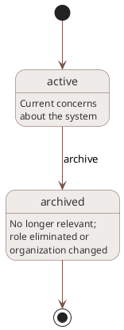

# Stakeholders

## Overview

Stakeholders (STK-*) represent named parties with concerns about the system under development. They represent the people, roles, organizations, or communities whose expectations drive the project's needs. Stakeholder identification is a project-specific activity: no fixed taxonomy of stakeholder types exists. Each project defines its own stakeholders based on who actually cares about the system and what they care about.

## Purpose

Stakeholders serve multiple roles in the knowledge graph.

They anchor the top of the traceability chain. Every need traces to at least one stakeholder, every requirement traces through needs to stakeholders, and every test case traces through requirements back to the stakeholder expectations that motivated them. When someone asks `who is this requirement for?`, the answer is a named stakeholder, not a generic category.

They support impact analysis. When a requirement changes, the stakeholder link answers "who should the team talk to about this?" When someone marks a need obsolete, the stakeholder context explains whose expectations shifted.

They inform formalization. When the agent formalizes a concept into needs, it walks through the project's stakeholders and asks what each one expects from the concept. Without explicit stakeholders, this step defaults to generic categories that may miss real parties or invent irrelevant ones.

## Lifecycle

Stakeholders have a minimal lifecycle:

```text
active → archived
```



| State | Description |
|-------|-------------|
| active | This stakeholder has current concerns about the system |
| archived | This stakeholder is no longer relevant (role eliminated, organization changed, etc.) |

Archiving a stakeholder does not invalidate the needs linked to it. Those needs may still be valid even if the original stakeholder is no longer active. Archiving is informational, not a cascade trigger.

## Storage model

ARCI stores stakeholder vertex data in the `stakeholders` table (`stakeholders.ndjson` on disk). Stakeholders have no outgoing relationship properties; needs reference them via the `stakeholder` edge table.

```json
{"id": "STK-H5N7P3Q9", "type": "Stakeholder", "title": "CLI end user", "description": "Developers who use the tool from the command line as part of their daily workflow", "concerns": "Usability, performance, clear error messages, predictable behavior", "status": "active"}
```

Fields:

- `id`: Unique identifier (STK-XXXXXXXX format)
- `type`: Always "Stakeholder"
- `title`: Human-readable name for this stakeholder (role, group, or individual)
- `description`: Who this stakeholder is and what their relationship to the system is
- `concerns`: What this stakeholder cares about, in their terms
- `summary`: Inline prose for extended context; organizational background, relationship details, interview notes (optional)
- `status`: Lifecycle state (active, archived)
- `created`, `updated`: ISO 8601 timestamps
- `tags`: Array of strings (optional)

Stakeholders do not have a `module` property. They exist at the project level without scoping to a specific module. A stakeholder's concerns may span the entire system.

The `description` and `concerns` fields fully describe most stakeholders. Stakeholders that accumulate extensive supporting material (interview transcripts, persona research, organizational context) can use `summary` for inline extended context and a prose file at `.arci/stakeholders/{timestamp}-{NANOID}-{slug}.md` for longer material. See [Prose files](../schema.md#prose-files) for the path convention.

## Relationships

### Incoming relationships (queried via graph)

| Property | Source | Description |
|----------|--------|-------------|
| stakeholder | NEED-* | Needs that express this stakeholder's expectations |

Stakeholders have no outgoing object properties to other graph nodes. Needs reference them via the `stakeholder` property. To find a stakeholder's needs, query for NEED-* nodes whose `stakeholder` property includes the STK-* identifier.

## Relationship to needs and concepts

Stakeholders sit alongside concepts at the top of the transformation chain. Concepts capture what the team explored and decided. Stakeholders capture who cares and why. Formalization combines both: it reads a crystallized concept's content and, for each relevant stakeholder, extracts the expectations that concept implies for that party.

```text
CON-* (what was decided)  +  STK-* (who cares)
                    ↓ formalize
              NEED-* (what they expect)
                    ↓ derive
              REQ-* (what we must build)
```

A single need may reference multiple stakeholders when multiple parties share an expectation. "The system shall produce machine-readable error output" might serve both a CI/CD pipeline operator and a tool integration developer. Rather than duplicating the need per stakeholder, the `stakeholder` property on the need is multi-valued.

## CLI commands

```bash
# CRUD
arci stakeholder create --title "CLI end user" \
  --description "Developers who use the tool from the command line" \
  --concerns "Usability, performance, clear error messages"
arci stakeholder show STK-H5N7P3Q9
arci stakeholder list
arci stakeholder list --status active
arci stakeholder update STK-H5N7P3Q9 --concerns "Updated concerns"
arci stakeholder delete STK-H5N7P3Q9

# Lifecycle
arci stakeholder archive STK-H5N7P3Q9

# Queries
arci stakeholder needs STK-H5N7P3Q9  # Show all needs for this stakeholder
```

See [Stakeholder](../../cli/commands/stakeholder.md) for full CLI documentation.

## Examples

### End user stakeholder

```json
{"id": "STK-H5N7P3Q9", "type": "Stakeholder", "title": "CLI end user", "description": "Developers who use the tool from the command line as part of their daily workflow", "concerns": "Usability, performance, clear error messages, predictable behavior", "status": "active"}
```

### Integrator stakeholder

```json
{"id": "STK-1NT3GR8R", "type": "Stakeholder", "title": "Tool integrator", "description": "Developers building editor plugins, CI pipelines, or other tooling that consumes this tool's output programmatically", "concerns": "Stable API surface, machine-readable output, versioning, backward compatibility", "status": "active"}
```

### Organizational stakeholder

```json
{"id": "STK-C0MPL1NC", "type": "Stakeholder", "title": "Compliance office", "description": "Internal compliance team responsible for ensuring software meets regulatory requirements", "concerns": "Audit trails, data handling, access controls, change documentation", "status": "active"}
```

## Design notes

Stakeholders are intentionally lightweight. They carry a title, description, concerns, and an optional summary. ARCI provides no fixed taxonomy of stakeholder types, no required classification scheme, and no enumeration of valid stakeholder categories. Projects define whatever stakeholders make sense for their context: a solo developer's side project might have two stakeholders (the developer as user and the developer as maintainer), while a regulated enterprise system might have a dozen (patients, clinicians, regulatory bodies, hospital IT, biomedical engineers, insurance providers).

The concerns field is freeform text rather than structured data. Stakeholder concerns are inherently qualitative and varied. Structuring them as typed categories would either be too rigid (missing real concerns) or too generic (not adding information beyond what the title and description already convey). The concerns field is a prompt for the formalization step: when the agent reads a stakeholder's concerns alongside a crystallized concept, it can identify which expectations that concept implies for that party.

Stakeholders do not participate in suspect link propagation. Modifying a stakeholder's concerns does not mark downstream needs as suspect, because the stakeholder-to-need relationship flows through the `stakeholder` object property on needs rather than through a `derivesFrom` chain. If a stakeholder's concerns change enough that existing needs warrant re-evaluation, the developer creates defects against those needs or re-runs formalization.
