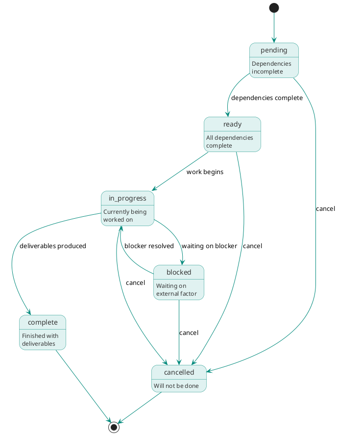

# Tasks module type

## Overview

Tasks (TASK-*) are atomic units of work with verifiable deliverables. Unlike hierarchical plan structures, tasks exist in a flat DAG where edges express dependencies. The "plan" for any scope is simply the subgraph of tasks reachable from a target.

Tasks have a process phase attribute indicating where they fit in the ISO/IEC/IEEE 15288 lifecycle, enabling phase-gated execution.

## Purpose

Tasks serve multiple roles:

**Work decomposition**: complex work breaks down into manageable, atomic tasks that Claude Code can execute in focused sessions.

**Dependency management**: dependsOn relationships express ordering. Tasks can't start until dependencies complete.

**Phase organization**: the phase attribute organizes work by lifecycle stage and enables phase gates.

**Progress tracking**: task status shows what's done, what's in progress, what's blocked.

**Deliverable tracking**: each task's `deliverables` array records what it produced.

## Process phases

Tasks belong to one of six phases from ISO/IEC/IEEE 15288:

| Phase          | Purpose                                     | Example task types                                 |
|----------------|---------------------------------------------|----------------------------------------------------|
| architecture   | Identify components, boundaries, interfaces | decompose-module, define-interface                  |
| design         | Define APIs, data models, algorithms        | design-api, design-data-model, design-algorithm    |
| coding | Build the thing                             | build-feature, refactor, write-documentation       |
| integration    | Assemble components, resolve interfaces     | integrate-components, integrate-deployment         |
| verification   | Test against requirements                   | execute-tests, review-code, audit-security         |
| validation     | Confirm the system meets stakeholder needs  | accept-user, demo-stakeholder                      |

See CON-K7M3NP2Q for detailed task types per phase.

## Lifecycle

Tasks progress through states:

```text
pending → ready → in_progress → blocked → complete → cancelled
```



| State       | Description                               |
|-------------|-------------------------------------------|
| pending     | Not yet ready (dependencies incomplete)   |
| ready       | All dependencies complete, work can start |
| in_progress | Someone is actively working on this       |
| blocked     | Started but waiting on something          |
| complete    | Finished with deliverables                |
| cancelled   | Abandoned with stated reason               |

State transitions:

- `pending → ready`: All dependsOn tasks complete
- `ready → in_progress`: Work begins (session started)
- `in_progress → blocked`: Waiting on external factor
- `in_progress → complete`: Deliverables produced
- `* → cancelled`: Task cancelled with reason

## DAG structure

Tasks form a directed acyclic graph via dependsOn relationships:

```text
TASK-arch-parser
    ↓
TASK-design-parser-api
    ↓
TASK-impl-lexer ─────────────────┐
    ↓                           │
TASK-impl-tokenizer              │
    ↓                           ↓
TASK-test-parser ←───────── TASK-review-parser
    ↓                           │
    └───────────┬───────────────┘
                ↓
         TASK-release-1.0
```

### DAG queries

```bash
arci task ancestors TASK-R7V3W9Y1      # What does this depend on?
arci task descendants TASK-G5M2R8X4    # What depends on this?
arci task blocking TASK-R7V3W9Y1       # Incomplete ancestors
arci task ready                        # Tasks with no incomplete dependencies
arci task critical-path TASK-R7V3W9Y1  # Longest path to target
```

### "Plans" as queries

ARCI has no plan containers. Work organization emerges from queries:

```bash
# "What's the plan for the parser?"
arci task list --module MOD-A4F8R2X1 --include-descendants

# "What's in release 1.0?"
arci task ancestors TASK-R7V3W9Y1

# "What's blocking release?"
arci task blocking TASK-R7V3W9Y1

# "What's ready to work on?"
arci task ready
```

## Storage model

ARCI stores task vertex data in the `tasks` table (`tasks.ndjson` on disk). Edge tables hold all relationships separately.

```json
{"id": "TASK-E3K8S6V2", "type": "Task", "title": "Implement lexer tokenization", "processPhase": "implementation", "taskType": "implement-feature", "status": "complete", "priority": "high", "summary": "Lexer needs to handle Unicode identifiers and produce a flat token stream. State machine approach preferred."}
```

The `module` and `dependsOn` relationships live in edge tables. In `module.ndjson`:

```json
{"src": "TASK-E3K8S6V2", "dst": "MOD-A4F8R2X1"}
```

In `depends_on.ndjson`:

```json
{"src": "TASK-E3K8S6V2", "dst": "TASK-G5M2R8X4"}
```

Fields:

- `id`: Unique identifier (TASK-XXXXXXXX format)
- `type`: Always "Task"
- `title`: Human-readable title
- `description`: Brief description (optional)
- `summary`: Inline prose for context, approach, and notes (optional)
- `processPhase`: Process phase (architecture, design, coding, integration, verification, validation)
- `taskType`: Type within phase (such as build-feature, review-code)
- `status`: Lifecycle state (pending, ready, in_progress, blocked, complete, cancelled)
- `priority`: high, medium, low
- `assignee`: Who's working on this (optional)
- `started`, `completed`: ISO 8601 timestamps (optional)
- `created`, `updated`: ISO 8601 timestamps
- `tags`: Array of strings (optional)
- `deliverables`: Array of deliverable objects (optional)

The `module`, `dependsOn`, and `implements` predicates live in their respective edge tables.

## Deliverables

Tasks track outputs via a `deliverables` array with `kind` discriminator:

| Kind         | Fields                               | Example                            |
|--------------|--------------------------------------|------------------------------------|
| document     | path, type                           | API spec, architecture doc         |
| diagram      | path, type                           | Sequence diagram, module hierarchy |
| commit       | sha, message                         | Git commit                         |
| file         | path, action                         | Source file created/modified       |
| test-results | passed, failed, skipped, report_path | Test execution                     |
| findings     | ids                                  | Findings extracted from review     |
| artifact     | type, name, version                  | npm package, docker image          |
| external     | type, url                            | Pull request, issue                |

Example with deliverables:

```json
{"id": "TASK-E3K8S6V2", "type": "Task", "title": "Implement lexer", "processPhase": "implementation", "status": "complete", "deliverables": [{"kind": "commit", "sha": "a1b2c3d4e5f6", "message": "Implement lexer tokenization"}, {"kind": "file", "path": "src/parser/lexer.ts", "action": "created"}]}
```

With edge: `module` → MOD-A4F8R2X1.

## Prose files

Most tasks get by with the `summary` field for a paragraph or two of inline context. Complex tasks that need more room can have a prose file at `.arci/tasks/{timestamp}-{NANOID}-{slug}.md`, with the path derived from the node's identifier. See [Prose files](../schema.md#prose-files) for the full convention.

When a task has a prose file, it typically contains:

```markdown
# Implement lexer tokenization

## Context

The lexer is the first stage of the parser pipeline. It transforms
raw input into a stream of tokens.

## Requirements to satisfy

- REQ-C2H6N4P8: Error reporting within 50ms
- REQ-T0K3N001: All token types recognized

## Approach

Use a state machine approach with...

## Progress

- [x] Define token types
- [x] Implement state machine
- [ ] Add error recovery
- [ ] Performance optimization

## Notes

Discovered edge case with Unicode identifiers...
```

## Relationships

Edge tables hold all relationships. Each edge table row has `src` and `dst` columns identifying the source and target nodes.

### Outgoing relationships

| Property    | Target | Cardinality | Description                     |
|-------------|--------|-------------|---------------------------------|
| module      | MOD-*  | Single      | Module this task is for         |
| dependsOn   | TASK-*  | Multi       | Tasks this depends on           |
| builds  | REQ-*  | Multi       | Requirements this task satisfies |

### Incoming relationships (queried via graph)

| Property  | Source | Description                     |
|-----------|--------|---------------------------------|
| dependsOn | TASK-*  | Tasks that depend on this       |
| generates | DEF-*  | Findings that created this task |

Example vertex record and associated edge table rows:

```json
{"id": "TASK-E3K8S6V2", "type": "Task", "title": "Implement lexer", "processPhase": "implementation", "status": "ready"}
```

In `module.ndjson`: `{"src": "TASK-E3K8S6V2", "dst": "MOD-A4F8R2X1"}`

In `depends_on.ndjson`:

```json
{"src": "TASK-E3K8S6V2", "dst": "TASK-G5M2R8X4"}
{"src": "TASK-E3K8S6V2", "dst": "TASK-D3S1GN01"}
```

## Task type definitions

A markdown file with YAML frontmatter defines each task type. The frontmatter carries structural metadata that ARCI uses for validation and gating. The markdown body is a template that `arci task render` processes and the `arci:task` skill inlines into the agent's prompt at execution time.

```markdown
---
name: implement-feature
phaseIndependent: false
processPhase: implementation
expectedDeliverables:
  - kind: commit
  - kind: file
    action: [created, modified]
completionCriteria:
  requireDeliverables: true
  requireTests: false
createdBy:
  - arci:decompose
  - manual
---

# Implement feature

You are implementing a feature to satisfy the requirements in scope.

## Approach

{{ #each requirements }}

- {{ this.id }}: {{ this.title }}
{{ /each }}

Implement the feature described by the linked requirements. Record
each file you create or modify as a deliverable. Commit your work
with a message that references the task ID.
```

When `arci task create` runs with `--task-type implement-feature`, it resolves the type definition from the cascade, validates that it exists, and copies the frontmatter's structural fields (`expectedDeliverables`, `completionCriteria`) onto the TASK-* node. The system freezes these fields at creation time: if the type definition's frontmatter changes later, existing tasks keep the contract from their original creation.

The template body is not frozen. `arci task render` resolves the type definition fresh from the cascade at execution time, assembles a context object from the task's graph neighborhood, and processes the template. Instruction improvements propagate to any task that nobody has executed yet without changing its completion contract.

### Definition file format

The frontmatter supports these fields:

`name` is the identifier used in `taskType` on TASK-* nodes and in `--task-type` CLI arguments. Must be unique within a cascade layer.

`phaseIndependent` controls whether module phase gates this type. When `true`, the definition omits `processPhase` and the system sets it on the task node based on context at creation time. When `false` (the default), the definition requires `processPhase`.

`processPhase` specifies which lifecycle phase this type belongs to. The task-completion-gate policy checks that the task's module is in this phase or later. Omitted when `phaseIndependent` is `true`.

`expectedDeliverables` is an array of deliverable shape objects that the task-completion-gate policy checks against the task's `deliverables` array at completion. The gate verifies structural presence, not quality.

`completionCriteria` contains additional conditions beyond deliverable presence. The completion gate checks fields like `requireDeliverables`, `requireTests`, and `requireExplicitAssessment`.

`createdBy` lists the skills and creation modes that produce tasks of this type. This is documentation, not enforcement: any skill or manual `arci task create` can create any type.

### Template context

The context object available to templates during rendering is the same data that `arci context` assembles for the task. Template authors can reference:

`task` contains the task's own fields: `id`, `title`, `summary`, `status`, `priority`, `processPhase`, `taskType`, `tags`.

`module` contains the parent module's fields: `id`, `title`, `phase`, `description`.

`requirements` is an array of requirement nodes linked to this task via `implements` edges, each with `id`, `title`, `statement`, `priority`, `verificationMethod`.

`defects` is an array of defect nodes linked via `generates` (queried as the inverse; the defect generated this task), each with `id`, `title`, `severity`, `subject`. Primarily relevant for `remediate-defect` tasks.

`dependencies` is an array of upstream task nodes from `dependsOn`, each with `id`, `title`, `status`, `taskType`, `deliverables`.

`testCases` is an array of TC-* nodes linked to the requirements in scope, each with `id`, `title`, `verificationMethod`, `acceptanceCriteria`.

This context is a stable contract. Adding fields is non-breaking; removing or renaming fields is a breaking change to the template API.

### Cascade resolution

Task type definitions load from a cascade that follows the same layering as policies, with whole-file replacement semantics:

```text
Built-in task types (ship with arci)
    ↓
<system config dir>/task-types.d/*.md
    ↓
<user config dir>/task-types.d/*.md
    ↓
<project config dir>/task-types.d/*.md
    ↓
<project config dir>/task-types.local.d/*.md
```

Resolution is by `name` in frontmatter, not filename. A type at a higher-precedence layer with the same name replaces the lower-precedence definition. No partial merging: if you override `implement-feature` at the project level, you provide the entire definition, both frontmatter and template body. Partial merging of template bodies would be nonsensical, and partial merging of frontmatter would create confusing hybrid definitions.

Qualified names work the same way as policies: `arci task-type show implement-feature` resolves to the highest-precedence layer, while `arci task-type show builtin/implement-feature` gets the built-in version. Layer names for qualification are `builtin`, `system`, `user`, `project`, `project-local`.

Custom task types are how teams extend ARCI for domain-specific work. An ML team might define `train-model` in their project's `task-types.d/`, and the `arci:decompose` skill or a developer via `arci task create --task-type train-model` can use it immediately. See [Task types](../../workflows/tasks/index.md#extensibility) for more on how custom types participate in decomposition.

## Execution

Tasks execute in atomic Claude Code sessions. The `arci:task` skill uses command inlining to assemble the agent's prompt from two CLI commands:

```text
Context:

!`arci context TASK-E3K8S6V2`

Workflow:

!`arci task render TASK-E3K8S6V2`
```

`arci context` produces the graph context: task details, module information, related requirements, dependency status, and previous session notes. `arci task render` produces the rendered task type template: workflow instructions, approach guidance, and completion expectations specific to this type of work. The skill itself is a thin orchestration layer that wires these two outputs together without knowing anything about template engines or cascade resolution.

A custom task type works the moment its definition file lands in a `task-types.d/` directory. No skill changes, no plugin updates.

### Session state

During execution, session state tracks the active task, phase constraints, progress checkpoints, and pending deliverables. If a session ends early, the next session can resume from checkpoints.

## CLI commands

```bash
# CRUD
arci task create --module MOD-A4F8R2X1 --title "Implement lexer" \
  --phase implementation --task-type implement-feature
arci task show TASK-E3K8S6V2
arci task list
arci task list --module MOD-A4F8R2X1 --phase implementation --status ready
arci task update TASK-E3K8S6V2 --status in_progress
arci task delete TASK-E3K8S6V2

# Dependencies
arci task depend TASK-E3K8S6V2 --on TASK-G5M2R8X4
arci task undepend TASK-E3K8S6V2 --on TASK-G5M2R8X4

# DAG queries
arci task ancestors TASK-E3K8S6V2
arci task descendants TASK-E3K8S6V2
arci task blocking TASK-E3K8S6V2
arci task ready
arci task critical-path TASK-R7V3W9Y1

# Execution
arci task start TASK-E3K8S6V2      # Mark in_progress
arci task complete TASK-E3K8S6V2   # Mark complete
arci task block TASK-E3K8S6V2 --reason "Waiting on API decision"
arci task cancel TASK-E3K8S6V2 --reason "No longer needed"

# Deliverables
arci task deliverable TASK-E3K8S6V2 --kind commit --sha a1b2c3d4
arci task deliverables TASK-E3K8S6V2  # List deliverables

# Context and rendering
arci context TASK-E3K8S6V2
arci task render TASK-E3K8S6V2

# Task type definitions
arci task-type list
arci task-type show implement-feature
arci task-type show builtin/implement-feature
```

See [Task](../../cli/commands/task.md) for full CLI documentation.

## Examples

### Architecture task

```json
{"id": "TASK-4RCH0001", "type": "Task", "title": "Parser module decomposition", "processPhase": "architecture", "taskType": "decompose-module", "status": "complete", "deliverables": [{"kind": "document", "type": "architecture-doc", "path": "modules/MOD-A4F8R2X1/architecture.md"}]}
```

With edge: `module` → MOD-A4F8R2X1.

### Implementation task

```json
{"id": "TASK-E3K8S6V2", "type": "Task", "title": "Implement lexer tokenization", "processPhase": "implementation", "taskType": "implement-feature", "status": "complete", "deliverables": [{"kind": "commit", "sha": "a1b2c3d4e5f6", "message": "Implement lexer tokenization"}]}
```

With edges: `module` → MOD-A4F8R2X1, `depends_on` → TASK-D3S1GN01, `implements` → REQ-C2H6N4P8.

### Verification task

```json
{"id": "TASK-V3R1FY01", "type": "Task", "title": "Parser code review", "processPhase": "verification", "taskType": "review-code", "status": "complete", "deliverables": [{"kind": "findings", "ids": ["DEF-F1L4T7W5", "DEF-K8Q3V6X2"]}, {"kind": "document", "type": "review-report", "path": "modules/MOD-A4F8R2X1/reviews/2026-01-03.md"}]}
```

With edge: `module` → MOD-A4F8R2X1.

### Milestone task

```json
{"id": "TASK-R7V3W9Y1", "type": "Task", "title": "Release 1.0", "processPhase": "validation", "taskType": "release", "status": "pending"}
```

With edges: `module` → MOD-OAPSROOT, `depends_on` → TASK-V3R1FY01, `depends_on` → TASK-D0CS0001.

## Summary

Tasks are atomic work units that:

- Form a DAG with dependsOn relationships
- Belong to a process phase (architecture → validation)
- Track status from pending through complete
- Record deliverables with kind-specific fields
- Execute in atomic Claude Code sessions
- Replace plan containers with graph queries
- Stored as rows in the `tasks` vertex table (`.arci/graph/tasks.ndjson` on disk)
- Implemented following three-layer architecture (core/io/service)

The task DAG is the work organization: milestones are downstream tasks, scopes are transitive closures, and `the plan` is a query over the graph.
