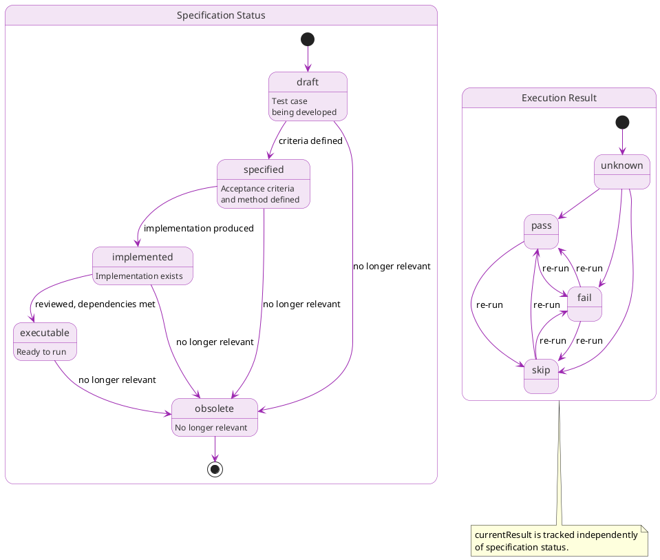

# Test cases

## Overview

Test cases (TC-*) specify how to verify that requirements hold. Each test case defines what to check and how, using one of four verification methods (inspection, demonstration, test, analysis), and links to the requirements it verifies via verifiedBy relationships.

Test cases are **specifications**, not combined specification+execution entities. The specification lifecycle (draft through executable) tracks the maturity of the test case itself. The `currentResult` field tracks execution results separately.

Test cases exist at different levels corresponding to the module hierarchy. Component-level testcases verify component requirements; integration testcases verify interface requirements; system testcases verify system-level requirements.

## Purpose

Test cases serve multiple roles:

**Verification evidence**: test cases provide evidence that requirements hold. When testcases pass, the linked requirements can transition to "verified" status.

**Regression protection**: automated testcases (those using the test method) catch regressions when changes break previously verified requirements.

**Coverage tracking**: the verifiedBy relationship enables coverage analysis, showing which requirements have verification, which do not, and which have gaps.

**Specification**: test cases document expected behavior and acceptance criteria. For complex verification types (benchmarks, e2e tests, analyses), the coding is a task deliverable that reviewers can examine independently and file defects against.

## Verification methods

From INCOSE, testcases use one of four verification methods:

| Method        | Description                                | When to use                              |
|---------------|--------------------------------------------|------------------------------------------|
| test          | Execute with defined inputs, check outputs | Behavioral requirements, APIs            |
| inspection    | Examine artifacts without execution        | Code standards, documentation presence   |
| demonstration | Operate system, observe behavior           | User-facing workflows, UI requirements   |
| analysis      | Models, calculations, simulations          | Performance projections, safety analysis |

## Lifecycle

Test cases progress through specification states:

```text
draft → specified → implemented → executable → obsolete
```



| State       | Description                                      |
|-------------|--------------------------------------------------|
| draft       | Author developing the test case                  |
| specified   | Acceptance criteria and method defined           |
| implemented | Implementation exists (test code, checklist, etc.) |
| executable  | Ready to run, all dependencies satisfied         |
| obsolete    | No longer relevant                               |

State transitions:

- `draft → specified`: Author defines acceptance criteria and verification method
- `specified → implemented`: A verification-coding task (or author) produces the test code
- `implemented → executable`: Reviewer approves the test code, all dependencies satisfied
- `* → obsolete`: Test case no longer relevant

### Execution results

Two fields track execution results separately from the specification lifecycle:

- `currentResult`: The latest execution result; `pass`, `fail`, `skip`, or `unknown`
- `lastRunAt`: ISO 8601 timestamp of the last execution

A test case's specification status (`executable`) is independent of whether it currently passes or fails. A test case can be `executable` with `currentResult: fail`; the specification is complete but the system doesn't yet meet it.

## Test case levels

Test cases align with the module hierarchy:

| Level       | Module scope | Test cases                          |
|-------------|--------------|-------------------------------------|
| Unit        | Component    | Function/method testcases          |
| Integration | Subsystem    | Component interaction testcases    |
| System      | Root         | End-to-end testcases               |
| Acceptance  | Root         | Stakeholder validation              |

Unit-level testcases verify a component module's requirements. Integration testcases verify a subsystem's interface requirements. System-level requirements need system testcases.

## Storage model

ARCI stores test case vertex data in the `test_cases` table (`test_cases.ndjson` on disk). Edge tables hold all relationships separately.

```json
{"id": "TC-D9J5Q1R3", "type": "TestCase", "title": "Parser error latency benchmark", "description": "Verifies error reporting meets 50ms requirement", "method": "test", "level": "unit", "status": "executable", "currentResult": "pass", "lastRunAt": "2026-01-15T14:30:00Z", "acceptanceCriteria": "p99 latency < 50ms across 1000 iterations", "implementation": "tests/parser/error_latency_test.ts"}
```

The `module` relationship lives in the `module.ndjson` edge table:

```json
{"src": "TC-D9J5Q1R3", "dst": "MOD-A4F8R2X1"}
```

Fields:

- `id`: Unique identifier (TC-XXXXXXXX format)
- `type`: Always `TestCase`
- `title`: Human-readable title
- `description`: What this test case verifies (optional)
- `method`: Verification method (inspection, demonstration, test, analysis)
- `level`: Test case level (unit, integration, system, acceptance)
- `status`: Specification lifecycle state (draft, specified, implemented, executable, obsolete)
- `currentResult`: Latest execution result (pass, fail, skip, unknown)
- `lastRunAt`: ISO 8601 timestamp of last execution (optional)
- `acceptanceCriteria`: Explicit pass/fail criteria (optional)
- `summary`: Inline prose for extended context; test rationale, environment setup, edge cases (optional)
- `coding`: Path to test code or procedure (optional)
- `created`, `updated`: ISO 8601 timestamps
- `tags`: Array of strings (optional)

The `module` and `verifies` predicates live in their respective edge tables.

## Prose files

`acceptanceCriteria` and the type-specific fields (`checklist`, `procedure`, `approach`) fully describe most testcases. Complex testcases (detailed analysis methods, multi-step demonstration procedures, environment-specific setup) may need a prose file at `.arci/test-cases/{timestamp}-{NANOID}-{slug}.md`, with the path derived from the node's identifier. See [Prose files](../schema.md#prose-files) for the full convention.

## Relationships

Edge tables hold all relationships. Each edge table row has `src` and `dst` columns identifying the source and target nodes.

### Outgoing relationships

| Property | Target | Cardinality | Description                              |
|----------|--------|-------------|------------------------------------------|
| module   | MOD-*  | Single      | Module this test case belongs to         |
| verifies | REQ-*  | Multi       | Requirements this test case verifies     |

### Incoming relationships (queried via graph)

| Property   | Source | Description                               |
|------------|--------|-------------------------------------------|
| verifiedBy | REQ-*  | Requirements that this test case verifies  |

Note: verifiedBy on REQ points to TC; verifies on TC points to REQ. These are inverses.

Example vertex record and associated edge table rows:

```json
{"id": "TC-D9J5Q1R3", "type": "TestCase", "title": "Parser error latency benchmark", "method": "test", "level": "unit", "status": "executable", "currentResult": "pass", "acceptanceCriteria": "p99 latency < 50ms", "implementation": "tests/parser/error_latency_test.ts"}
```

In `module.ndjson`: `{"src": "TC-D9J5Q1R3", "dst": "MOD-A4F8R2X1"}`

In `verified_by.ndjson`: `{"src": "REQ-C2H6N4P8", "dst": "TC-D9J5Q1R3"}`

## Test case types

### Automated tests

Most common. Code that executes and asserts outcomes:

```json
{"id": "TC-D9J5Q1R3", "type": "TestCase", "title": "Parser error latency benchmark", "method": "test", "level": "unit", "status": "executable", "currentResult": "pass", "implementation": "tests/parser/error_latency_test.ts"}
```

With edge: `module` → MOD-A4F8R2X1.

### Inspection checklists

For requirements that artifact examination verifies:

```json
{"id": "TC-1NSP3CT1", "type": "TestCase", "title": "Documentation completeness", "method": "inspection", "level": "system", "status": "executable", "currentResult": "pass", "checklist": ["API documentation exists for all public functions", "Error codes are documented with examples", "README includes quick start guide"]}
```

With edge: `module` → MOD-OAPSROOT.

### Demonstrations

For requirements that operation and observation verify:

```json
{"id": "TC-D3M00001", "type": "TestCase", "title": "Module lifecycle demonstration", "method": "demonstration", "level": "acceptance", "status": "executable", "currentResult": "pass", "procedure": "Execute standard user workflow and verify outputs"}
```

With edge: `module` → MOD-B9G3M7K2.

### Analyses

For requirements that modeling or calculation verifies:

```json
{"id": "TC-4N4LYS15", "type": "TestCase", "title": "System latency analysis", "method": "analysis", "level": "system", "status": "executable", "currentResult": "pass", "approach": "Performance modeling based on component benchmarks", "conclusion": "System latency under load: 87ms (within 100ms budget)"}
```

With edge: `module` → MOD-OAPSROOT.

## Specification-coding decoupling

For complex verification types (benchmarks, e2e tests, analyses), a verification-coding task produces the coding as a deliverable. Reviewers can examine this coding independently and file defects against it. The test case specification (TC-* node) defines *what* to verify and the acceptance criteria; the coding (produced by a TASK-* node) defines *how*.

This decoupling means:

- A test case can reach `specified` before any coding exists
- Reviewers can review the coding task independently of the test case specification
- Authors can file defects against the coding without affecting the test case specification
- The same test case specification can have different implementations (say, different test tools)

## Coverage

Coverage tracks which requirements have verification:

```bash
arci tc coverage                         # Overall coverage report
arci tc coverage --module MOD-A4F8R2X1   # Module-specific
arci tc untested                         # Requirements without test cases
arci tc gaps                             # Requirements with insufficient coverage
```

Coverage analysis considers:

- Requirements with no verifiedBy links
- Requirements with only failing testcases (`currentResult`: fail)
- Requirements where verification method doesn't match requirement's verification method

## CLI commands

```bash
# CRUD
arci tc create --module MOD-A4F8R2X1 --title "Error latency test case" \
  --method test --implementation "tests/parser/error_latency_test.ts"
arci tc show TC-D9J5Q1R3
arci tc list
arci tc list --module MOD-A4F8R2X1 --result fail
arci tc update TC-D9J5Q1R3 --status implemented
arci tc delete TC-D9J5Q1R3

# Relationships
arci tc link TC-D9J5Q1R3 --verifies REQ-C2H6N4P8
arci tc unlink TC-D9J5Q1R3 --verifies REQ-C2H6N4P8

# Execution tracking
arci tc record TC-D9J5Q1R3 --result pass --duration 1250 --details "p99: 42ms"
arci tc record TC-D9J5Q1R3 --result fail --details "p99: 67ms (exceeds 50ms)"

# Coverage
arci tc coverage
arci tc coverage --module MOD-A4F8R2X1
arci tc untested
```

See [Tc](../../cli/commands/tc.md) for full CLI documentation.

## Examples

### Automated unit test case

```json
{"id": "TC-D9J5Q1R3", "type": "TestCase", "title": "Parser error latency benchmark", "method": "test", "level": "unit", "status": "executable", "currentResult": "pass", "lastRunAt": "2026-01-15T14:30:00Z", "acceptanceCriteria": "p99 latency < 50ms across 1000 iterations", "implementation": "tests/parser/error_latency_test.ts"}
```

With edges: `module` → MOD-A4F8R2X1, `verified_by` (from REQ-C2H6N4P8) → TC-D9J5Q1R3.

### Integration test case

```json
{"id": "TC-1NT3GR01", "type": "TestCase", "title": "Parser-CLI integration", "method": "test", "level": "integration", "status": "executable", "currentResult": "pass", "implementation": "tests/integration/parser_cli_test.ts"}
```

With edge: `module` → MOD-A4F8R2X1.

### Inspection test case

```json
{"id": "TC-D0C5CH3K", "type": "TestCase", "title": "Documentation completeness", "method": "inspection", "level": "system", "status": "executable", "currentResult": "pass", "checklist": ["README exists and is current", "API docs generated and published", "CONTRIBUTING.md present"]}
```

With edge: `module` → MOD-OAPSROOT.

### Demonstration test case

```json
{"id": "TC-D3M0CL11", "type": "TestCase", "title": "CLI workflow demonstration", "method": "demonstration", "level": "acceptance", "status": "executable", "currentResult": "pass", "procedure": "Execute standard user workflow and verify outputs"}
```

With edge: `module` → MOD-B9G3M7K2.

## Relationship to tasks

Verification-phase tasks create and execute test cases:

```json
{"id": "TASK-V3R1FY01", "type": "Task", "title": "Implement parser test cases", "processPhase": "verification", "taskType": "verification-implementation"}
```

With edge: `module` → MOD-A4F8R2X1.

Tasks can record test case execution results as deliverables.

## Summary

Test cases are verification specifications:

- Linked to requirements via verifies/verifiedBy relationships
- Use one of four methods: test, inspection, demonstration, analysis
- Exist at unit, integration, system, and acceptance levels
- Specification lifecycle: draft → specified → implemented → executable → obsolete
- Execution results tracked separately via `currentResult` (pass/fail/skip/unknown) and `lastRunAt`
- `acceptanceCriteria` field defines explicit pass/fail criteria
- Implementation is a task deliverable, decoupled from the specification
- Enable coverage analysis and gap identification
- Stored as rows in the `test_cases` vertex table (`.arci/graph/test_cases.ndjson` on disk)
- Implemented following three-layer architecture (core/io/service)

Test cases close the loop from requirements to evidence, proving that the system meets its obligations.
