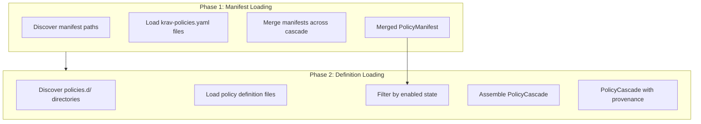

# Policy loading

This document describes how Krav loads and assembles policies from the configuration cascade. It complements [config-cascade.md](../configuration/config-cascade.md), which covers file locations and precedence rules, and [policy-model.md](policy-model.md), which describes the structure of individual policies. This document focuses on the loading algorithm, data structures, and design.

## Loading architecture

Policy loading separates domain logic from infrastructure concerns. The policy loader handles all external interactions: filesystem access, YAML parsing, and cascade traversal. The core engine operates only on domain types and has no knowledge of file paths, serialization formats, or the configuration hierarchy.

The loader performs four operations. Discovery determines which directories and files to check based on the cascade rules. Loading reads file contents from disk, handling missing files and permission errors. Parsing deserializes YAML content and validates it against the policy schema. Materialization transforms validated structures into typed domain objects that the core can compile.

The boundary between the loader and the core is `[]policy.Policy`. The loader produces this slice by reading, parsing, and merging configuration across the cascade. The core consumes it via `CompilePolicies()`, which validates expressions and prepares policies for efficient evaluation. This clean boundary makes the core easy to test in isolation since tests can construct `Policy` values directly without involving the filesystem.

This mirrors the config loading architecture described in [configuration.md](../configuration/configuration.md), but with different merging semantics. Main configuration uses key-value replacement where higher-precedence layers override lower ones. Policy loading uses collection assembly where policies from different layers coexist, with qualified names providing access to specific layers when needed.

## Two-phase loading

Policy loading requires two distinct phases because the merged manifest determines what to load, but you cannot know the merged manifest until you have loaded all manifest files from all layers.



In the first phase, the loader discovers and loads all `krav-policies.yaml` files from the cascade. These manifest files declare which policies to enable or turn off. The loader merges these manifests according to cascade precedence rules to produce a single effective manifest that controls policy state.

In the second phase, the loader discovers and loads policy definition files from `policies.d/` directories. It applies the merged manifest to determine each policy's enforcement state, then assembles the final `PolicyCascade` with full provenance tracking.

A project can turn off a user-level policy, and turned-off policies remain loaded and tracked (for diagnostics and override inspection) but excluded from the active policy set.

## Policy manifest loading

The policy manifest file `krav-policies.yaml` controls which policies are active without modifying policy definitions. The `krav hook policy enable/disable` commands manage policy state programmatically through this file.

### File format

```yaml
$schema: https://krav.sh/schemas/krav-policies/v1.yaml

defaultBehavior: all-enabled

enabled:
  - security-baseline
  - coding-standards
  - system/git-safety

disabled:
  - experimental-feature
  - user/verbose-logging
```

The `$schema` field identifies the manifest schema version. The `defaultBehavior` field controls the enforcement state for unlisted policies. Valid values are `all-enabled` (the default), `all-disabled`, and `all-audit`. The `enabled`, `disabled`, and `audit` arrays list policy names in either unqualified form (resolved at highest precedence) or qualified form with a layer prefix.

Policies in the `audit` list run in dry-run mode: deny actions become warnings, the system computes mutations but does not apply them, and it logs effects but does not execute them. Teams can use audit mode to trial new policies in production without risk.

### Merge rules

Manifest files use per-policy precedence: the highest-precedence layer that mentions a specific policy determines that policy's effective state. This is distinct from array replacement semantics where a higher layer's `enabled` array would replace a lower layer's array.

Consider this cascade:

```text
# managed/recommended/krav-policies.yaml
defaultBehavior: all-enabled
disabled:
  - dangerous-commands

# user/krav-policies.yaml
enabled:
  - dangerous-commands

# project/krav-policies.yaml
disabled:
  - dangerous-commands
```

The `dangerous-commands` policy ends up turned off because the project layer (highest precedence) explicitly turns it off, overriding the user layer's enabling. Both higher layers shadow the managed/recommended layer's setting.

Per-policy precedence means that policies not mentioned by higher layers keep their state from lower layers:

```text
# user/krav-policies.yaml
enabled:
  - my-preferences
  - verbose-logging

# project/krav-policies.yaml
enabled:
  - team-standards
```

Here `my-preferences` and `verbose-logging` remain enabled because project doesn't mention them. The project layer only affects `team-standards`. If project wanted to turn off a user-enabled policy, it would need to list it explicitly in `disabled`.

Within a single layer, a policy name appearing in more than one array (both `enabled` and `disabled`) is a validation error. The loader rejects the manifest and reports the conflicting entries.

The `defaultBehavior` field is not merged. The highest-precedence layer that specifies it wins. If no layer specifies it, the default is `all-enabled`.

### Self-declared enforcement state

Policy definitions may optionally declare their preferred default enforcement state using `config.default_state`:

```yaml
name: experimental-feature
config:
  default_state: disabled  # or: enabled, audit
```

This self-declaration acts as a hint that applies when no manifest explicitly references the policy (either by qualified name or by a matching unqualified reference). The precedence order is: manifest reference > policy self-declaration > layer `defaultBehavior`.

Self-declaration is useful for policies that ship off-by-default (opt-in features) or audit-by-default (new policies under evaluation). Without self-declaration, all policies inherit from `defaultBehavior`, which may not be appropriate for experimental or optional policies.

Local manifest files (`krav-policies.local.yaml`) override their non-local counterparts at the same cascade level. A policy turned off in the local file stays off regardless of its state in the non-local file.

### Override files

The `KRAV_POLICIES_FILE` environment variable replaces the entire manifest cascade with a single file. When set, the loader uses only this file for policy state determination. Managed/required manifests still apply on top for enterprise enforcement.

## Policy definition loading

Policy definitions live in `policies.d/` directories within each cascade layer. Each file contains a single policy definition as described in [policy-model.md](policy-model.md).

### Loading semantics

The loader processes files within a directory in lexicographical order. Use numeric prefixes to control ordering when declaration order matters:

```text
policies.d/
├── 00-security.yaml
├── 10-git-workflow.yaml
└── 20-coding-style.yaml
```

Each file defines exactly one policy. The `name` field within the file identifies the policy, not the filename. The filename serves as metadata for diagnostics but has no semantic meaning.

If two files within the same layer define a policy with the same name, the loader reports an error identifying both files. This catches configuration mistakes where someone accidentally creates a duplicate. Policies with the same name in different layers coexist intentionally; duplicates within a single layer are always an error.

### Layer coexistence

Unlike main configuration where higher layers replace lower ones, policies with the same name from different layers coexist in the cascade. The policy loader tracks the source layer for each policy definition.

```text
# user/policies.d/safety.yaml
name: security-baseline
rules: [...]

# project/policies.d/override.yaml
name: security-baseline
rules: [...]
```

The loader loads both policies. When code requests `security-baseline` by unqualified name, it receives the project layer's version (highest precedence). When code requests `user/security-baseline`, it receives the user layer's version.

This design supports three use cases: diagnostics can show all definitions of a policy across layers, users can inspect what they are overriding, and administrators can examine enterprise policies even when project policies shadow them.

### Local directories

The `policies.local.d/` directory provides a separate layer for personal policies that users should not commit to version control. Policies in this directory coexist with policies from `policies.d/` rather than replacing them by name.

```text
project/
├── policies.d/
│   └── team-standards.yaml      # name: team-standards
└── policies.local.d/
    └── my-experiment.yaml       # name: my-experiment (separate policy)
```

To override a project policy with a local variant, turn off the project policy in your local manifest and define a replacement in the local directory:

```yaml
# .krav/krav-policies.local.yaml
disabled:
  - team-standards

# .krav/policies.local.d/my-standards.yaml defines the replacement
```

This approach keeps the override intent explicit in the manifest rather than implicit through filename collisions.

### Override directories

The `KRAV_POLICIES_DIR` environment variable replaces the entire policy definition cascade with a single directory. When set, the loader uses only files from this directory. Managed/required policies still apply for enterprise enforcement.

## Qualified name resolution

Policy names support two forms: unqualified names and qualified names with layer prefixes.

### Unqualified names

An unqualified name like `security-baseline` resolves to the highest-precedence layer that defines a policy with that name. Requesting `security-baseline` returns the project layer's definition if one exists, otherwise the user layer's, and so on down the cascade. In most cases, users care about the effective policy, not where it came from.

### Qualified names

A qualified name like `system/security-baseline` selects a specific layer regardless of what higher layers define. This is useful for diagnostics, comparison, and explicit inheritance.

The valid layer prefixes correspond to cascade levels:

| Prefix | Layer |
|--------|-------|
| `managed-required` | Enterprise enforcement (cannot be overridden) |
| `managed-recommended` | Enterprise defaults (can be overridden) |
| `system` | System-wide configuration |
| `user` | User configuration |
| `project` | Project configuration |
| `project-local` | Project local overrides |
| `custom` | Override via environment variable |

### Resolution in manifests

Policy names in `krav-policies.yaml` files also support qualified form. Enabling `user/security-baseline` enables only the user layer's definition, not any project-level policy with the same name.

```yaml
enabled:
  - user/security-baseline    # enables specific layer
  - coding-standards          # enables highest-precedence match
```

Qualified names give precise control when the same policy name exists at more than one layer.

## Error handling

Policy loading follows fail-open semantics consistent with the Krav design philosophy. Configuration errors should never block the AI assistant from operating.

### Normal layers

When loading from normal cascade layers (system, user, project, local), the loader logs errors in individual files as warnings and skips the file. Loading continues with the remaining files, so a syntax error in one policy file does not prevent other policies from loading.

```text
warning: failed to parse /home/user/.config/krav/policies.d/broken.yaml: yaml: line 5: could not find expected ':'
```

The `krav hook policy validate` command and the server dashboard surface these warnings for users to investigate.

### Managed/required layer

The loader treats errors in the managed/required layer differently. If the loader cannot load any required managed configuration, the entire policy loading process fails. Accidental (or intentional) corruption cannot bypass enterprise security policies.

```text
error: failed to load required managed policies: /etc/krav/managed/required/policies.d/compliance.yaml: yaml: line 12: mapping values are not allowed in this context
```

This fail-closed behavior for managed/required ensures that critical security policies are never silently skipped.

### Validation errors

The loader handles schema validation errors (missing required fields, invalid field values) the same as parse errors: warn and skip for normal layers, fail for managed/required.

The core detects semantic validation errors (invalid CEL expressions, circular variable dependencies) during policy compilation, not during loading. The loader's job is to produce syntactically valid YAML structures; the core validates semantics.

## Integration with config loading

Policy loading occurs as part of the broader configuration loading process but is logically separate from main config loading.

### Loading sequence

The loader loads main configuration (`krav.yaml`) first because some settings may affect policy loading behavior (though currently none do). Policy manifest and definition loading follows. The sequence is:

1. Load and merge `krav.yaml` files from cascade
2. Load and merge `krav-policies.yaml` files from cascade
3. Load policy definition files from `policies.d/` directories
4. Apply manifest to determine enabled state
5. Return unified `LoadedConfig` with both settings and policies

### Factory pattern

The loader exposes a `Factory` type that provides lazy loading. Callers initialize the factory with the project directory and other configuration state, then retrieve a loaded configuration on demand by calling the `Load` method. The loaded configuration provides access to both the full policy set and the enabled-only subset.

The factory handles caching internally. Repeated calls to `Load` with the same parameters return the cached result. The server uses this caching to avoid reloading on every evaluation request.

### Hot reload integration

When running with the server and hot reload enabled, file watchers track both configuration and policy files. Changes trigger:

1. Re-reading affected files
2. Re-merging the cascade
3. Re-applying manifest state
4. Atomically swapping the new configuration

The server's existing hot reload infrastructure handles policies the same as other configuration.

## Data structures

The policy loading infrastructure uses three key types to track policies and their provenance through the cascade.

### Policy manifest type

The `PolicyManifest` type represents the merged state of all `krav-policies.yaml` files. It contains the following fields:

| Field | Description |
|-------|-------------|
| `DefaultBehavior` | The default enforcement state for unlisted policies: `all-enabled`, `all-disabled`, or `all-audit` |
| `Enabled` | Map of policy name to the cascade source that enabled it |
| `Disabled` | Map of policy name to the cascade source that turned it off |
| `Audit` | Map of policy name to the cascade source that set audit mode |

The manifest tracks not just the enforcement state but which source in the cascade determined that state. The `krav hook policy explain` command uses this provenance to show why a policy has a given enforcement state.

### Policy entry type

The `PolicyEntry` type wraps a policy definition with provenance information:

| Field | Description |
|-------|-------------|
| `Policy` | The parsed policy domain object |
| `Source` | The cascade source that provided this definition |
| `Layer` | The cascade layer (system, user, project, etc.) |
| `FilePath` | The filesystem path to the definition file |
| `IsLocal` | Whether the policy came from a `policies.local.d/` directory |
| `EnforcementState` | The effective state after applying the manifest: `enabled`, `disabled`, or `audit` |
| `StateSource` | The origin of the enforcement state decision (see below) |

The `StateSource` field records the origin of the enforcement decision:

| Value | Meaning |
|-------|---------|
| `from-manifest` | An explicit reference in an `krav-policies.yaml` file set this state |
| `from-self-declared` | The policy's own `config.default_state` field determined the state |
| `from-default` | The layer's `defaultBehavior` setting applied as a fallback |

The `krav hook policy explain` command uses `StateSource` to show not just the current state but the reason behind it.

### Policy cascade type

The `PolicyCascade` type is the primary interface for accessing loaded policies. Internally it holds the merged manifest, the full list of policy entries, and indexes for lookup by name and by layer.

The cascade exposes the following operations:

| Operation | Description |
|-----------|-------------|
| `Get(name)` | Returns the highest-precedence enabled policy with the given unqualified name, or nothing if not found or turned off |
| `GetQualified(qualifiedName)` | Returns a specific layer's policy by qualified name (such as `user/security-baseline`) |
| `Enabled()` | Returns all enabled policies in evaluation order |
| `All()` | Returns all policies regardless of enforcement state |
| `ForLayer(layer)` | Returns all policies from a specific cascade layer |
| `Sources()` | Returns the source cascade used to load this `PolicyCascade` |

The `PolicyCascade` reuses the `Source` and `Layer` types from the existing cascade infrastructure for consistency. It provides both collection-style access (all policies, all enabled) and lookup-style access (by name, by qualified name).

### Integration with Core

When passing policies to the core for compilation, the integration layer retrieves the enabled entries from the cascade and extracts the raw `Policy` domain objects into a flat collection. This collection is then handed to the core engine for compilation.

The core never sees `PolicyEntry` or `PolicyCascade` since those types exist to track provenance and loading metadata. The core operates only on domain types defined in `internal/core/policy`.
