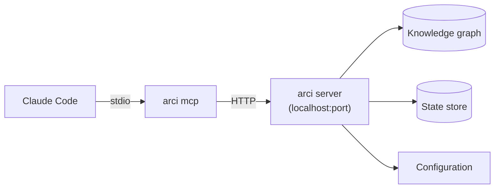

# MCP server

ARCI provides an MCP (Model Context Protocol) server that exposes diagnostic and introspection tools to Claude Code. The MCP server is a separate process from the main ARCI server, running over stdio transport as Claude Code expects.

## Relationship to the ARCI server

The MCP server is a thin proxy. It connects to the ARCI server's HTTP API and translates MCP tool calls into API requests. It holds no state of its own and performs no evaluation. If the ARCI server is not running, the MCP server reports errors through MCP tool responses rather than attempting to start the server itself. Lifecycle management stays cleanly separated: the user starts the ARCI server, and Claude Code starts the MCP server.



## Running the MCP server

The command is `arci mcp`. It runs in the foreground, communicating with Claude Code over stdin/stdout using the MCP protocol, and exits when the client disconnects.

`arci mcp` uses the same project root resolution as every other `arci` command: it walks up from cwd looking for `.arci/`, or respects `--project-dir` and `ARCI_PROJECT_DIR`. Once it knows the project root, it reads `.arci/server.json` to discover the running ARCI server's port (see [server discovery](../server/discovery.md)).

A typical Claude Code MCP configuration:

```json
{
  "mcpServers": {
    "arci": {
      "command": "arci",
      "args": ["mcp"],
      "cwd": "/path/to/project"
    }
  }
}
```

Setting `cwd` to the project root ensures the MCP server finds the correct `.arci/server.json`. If Claude Code's working directory is already the project root (the common case), you can omit `cwd`.

## Server discovery

On startup, `arci mcp` resolves the project root, reads `.arci/server.json`, verifies the PID is alive, and establishes a connection to `http://127.0.0.1:<port>`. If the lockfile is missing or the server process is dead, the MCP server does not attempt to start the ARCI server. Instead, tool calls that require the server return MCP error responses explaining that the server is not running.

Some tools may be able to operate without the server by reading NDJSON files directly via DuckDB's `read_json` function or opening the state database in read-only mode. This is a future consideration; the initial version proxies everything through the server.

## Tools

The MCP server exposes tools for introspection and diagnostics. These give Claude Code visibility into the hook system and knowledge graph without requiring the agent to parse log output or call the HTTP API directly.

### Diagnostic tools

`arci_status` returns the server's health, uptime, project root, and version. This lets Claude Code verify the server is running before attempting other operations.

`arci_policies` lists the active policies for the project with metadata: name, source file, priority, enabled status, event types, and rule count. Useful when Claude Code needs to understand what policies are in effect.

`arci_metrics` returns evaluation statistics: policy match counts, action execution counts, timing percentiles, and error counts. Useful for debugging performance or understanding hook activity.

### Graph tools

Graph query and mutation tools expose the knowledge graph to Claude Code through MCP. The spec system design determines the exact tool surface, but at minimum the MCP server should expose tools for querying nodes and their relationships, which Claude Code subagents need when executing tasks.

## Implementation

The MCP server uses the official Go SDK (`github.com/modelcontextprotocol/go-sdk`). The SDK handles protocol negotiation, transport, and message framing. The MCP server registers tools using the SDK typed handler API, where input and output schemas are auto-generated from Go structs.

Each tool handler is a thin function that makes an HTTP request to the ARCI server, transforms the response into MCP content, and returns it. Error handling follows MCP conventions: transport or server errors produce MCP error responses, not crashes.

```go
mcp.AddTool(server, &mcp.Tool{
    Name:        "arci_status",
    Description: "Check the arci server status",
}, func(ctx context.Context, req *mcp.CallToolRequest, input StatusInput) (*mcp.CallToolResult, StatusOutput, error) {
    resp, err := httpClient.Get(fmt.Sprintf("http://127.0.0.1:%d/health", port))
    // ... transform and return
})
```

The SDK `StdioTransport` handles communication with Claude Code. The MCP server process runs until the transport closes (Claude Code disconnects), then exits cleanly.

## Design constraints

The MCP server does not start, stop, or manage the ARCI server. It serves primarily as a read interface: diagnostic queries, graph reads, and status checks. Graph mutations through MCP tools are possible but should be carefully considered, since they bypass the CLI's validation and user-facing feedback.

The MCP server process is lightweight and stateless. Claude Code may start and stop it freely without concern for cleanup or resource leaks.
