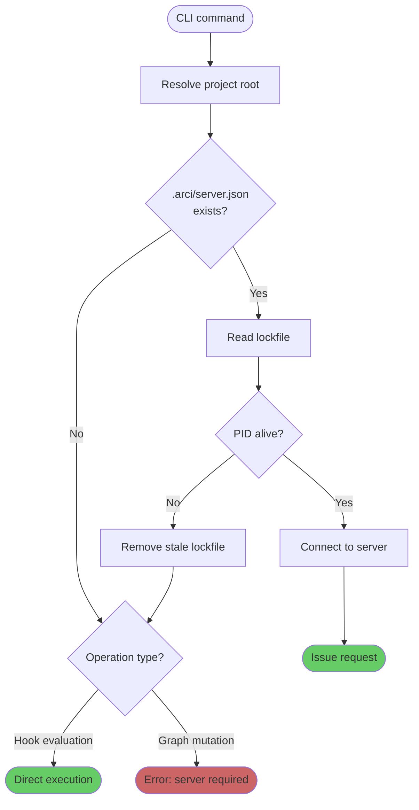

# Server discovery

Every arci command that talks to the server uses the same discovery mechanism: read `.arci/server.json` from the project directory. This lockfile is the single source of truth for whether a server is running and how to reach it.

## The lockfile

When `arci server` starts, it writes `.arci/server.json` to the project root:

```json
{
  "pid": 48210,
  "port": 7680,
  "version": "0.1.0",
  "started_at": "2026-03-01T14:23:07Z"
}
```

The file contains the server's process ID, the HTTP port it bound to, the arci version, and the start timestamp. The CLI, MCP server, and any other client read this file to locate the server.

When the server shuts down cleanly, it removes the lockfile.

## Discovery flow

When a CLI command needs the server, it resolves the project root (walking up from cwd looking for `.arci/`, or using `--project-dir` / `ARCI_PROJECT_DIR`), then checks for `.arci/server.json` at that root.

If the file does not exist, there is no server. Hook evaluation falls back to direct mode silently. Graph-mutating commands print an error: `the arci server is not running — start it with 'arci server'`.

If the file exists, the CLI reads the PID and checks whether that process is still alive (via `kill(pid, 0)` on Unix, `OpenProcess` on Windows). A dead process means the lockfile is stale. The CLI removes it and proceeds as if no server exists.

If the process is alive, the CLI connects to `http://127.0.0.1:<port>` and issues its request.



## Port selection

The server selects a port at startup by trying the configured base port (default 7680) and incrementing on failure. It tries up to 20 ports before giving up with an error. The server writes the actual bound port to the lockfile, so discovery always works regardless of which port the server ended up on.

The first project you start gets port 7680, the second gets 7681 (if 7680 is already in use), and so on. Users who care about a specific port can pass `--port` or set it in `arci.yaml`. Users who don't care never think about ports; the lockfile handles it.

## Stale lockfile handling

If the server crashes, receives SIGKILL, or the machine reboots, the lockfile remains on disk without a corresponding process. The discovery flow handles this: it reads the PID, checks process liveness, and removes the file if the process has exited. No separate cleanup server or garbage collection needs to run.

On Unix, the CLI checks process liveness with `kill(pid, 0)`, which tests existence without sending a signal. On Windows, `OpenProcess` followed by `GetExitCodeProcess` serves the same purpose.

A theoretical edge case exists where the OS recycles a PID and a different process now occupies it. In practice this is vanishingly rare for a development tool. If it causes problems, a future version could include the process start time in the lockfile and cross-check it, but this is not worth the complexity today.

## Version checking

The lockfile includes the arci version that started the server. If the CLI version does not match the server version (the user upgraded arci while a server was running), the CLI logs a warning suggesting the user restart the server. It does not automatically stop or restart the server.

## Gitignore

`.arci/server.json` should be gitignored. The `arci init` command (or documentation) should ensure `.arci/server.json` is in the project's `.gitignore`. The lockfile is ephemeral, machine-specific state that has no business in version control.

## Environment override

For cases where the CLI runs outside the project directory tree (CI scripts, remote tooling), `--project-dir` and `ARCI_PROJECT_DIR` tell the CLI where to find the project root. The discovery flow proceeds identically from there.

Claude Code hook invocations may fire from subdirectories of the project. The walk-up-the-tree search handles this naturally, the same way git commands work from any subdirectory of a repository.
